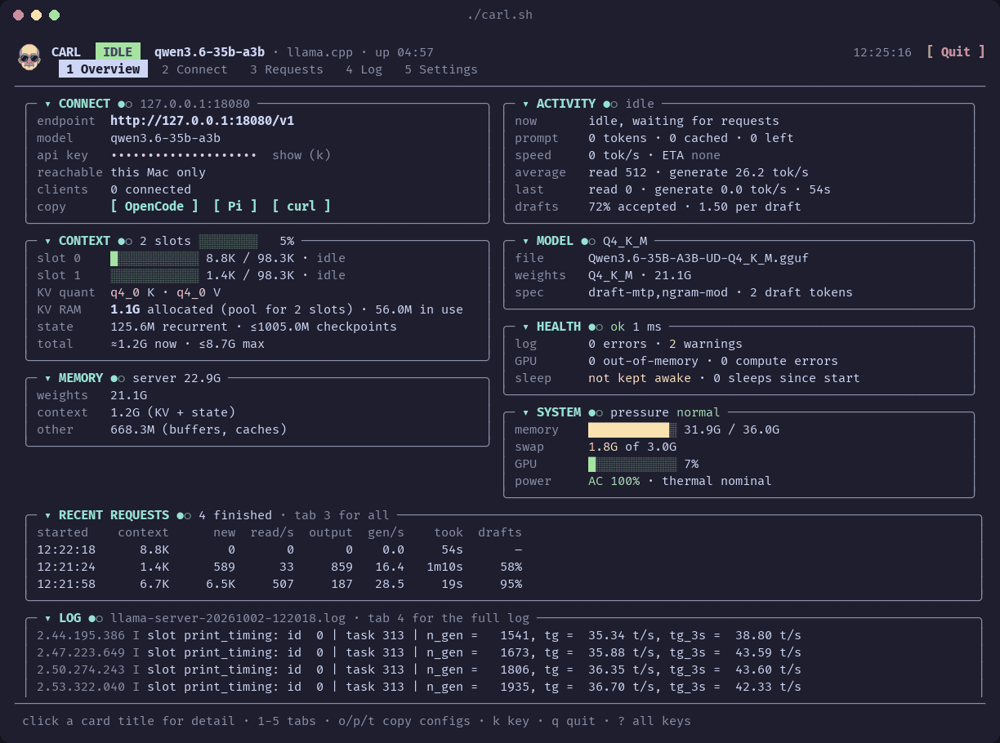
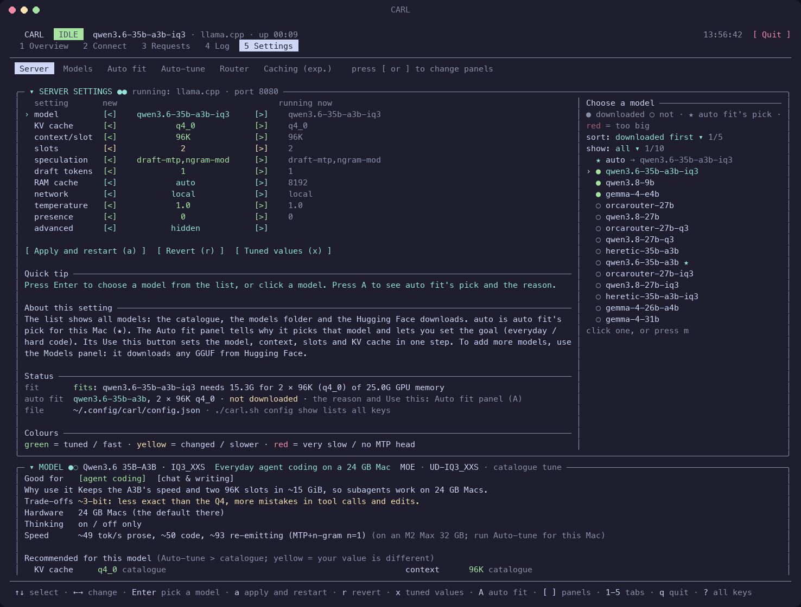
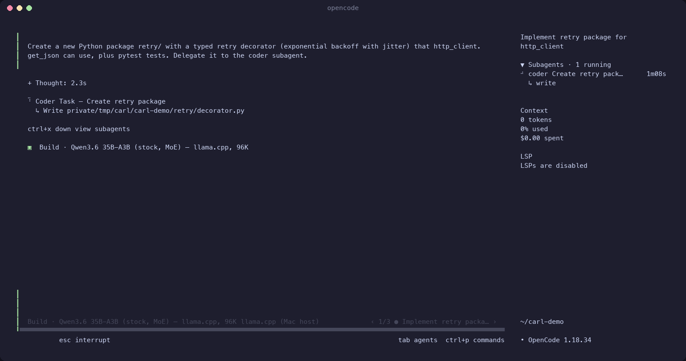

<p align="center"></p>

<h1 align="center">CARL</h1>

<h3 align="center"><b>C</b>an't <b>A</b>fford <b>R</b>emote <b>L</b>LMs</h3>

<p align="center"><i>AI Slop Coded LLM Runner, So You Can Code AI Slop Locally</i></p>

<p align="center">A local coding model runner on your Apple Silicon Mac, for <b>OpenCode</b> and <b>Pi</b>.<br>
One command starts the server and a live dashboard.</p>

---

## Install

**You need:** an Apple Silicon Mac, [Homebrew](https://brew.sh), `python3`, and 4.6–23 GB of free disk space for each model.

```bash
brew install llama.cpp aria2 ansifilter zstd
./carl.sh download default            # the best model for this Mac (resumable, checksum-verified)
./carl.sh install                     # OpenCode + Pi into ~/.local (no sudo), connected to the server
```

- If you skip the `brew install`, `./carl.sh` finds the missing tools and asks to install them.
- If you skip the download, `./carl.sh` asks to download the best model for this Mac.
- `./carl.sh install` asks one time which clients (OpenCode, Pi or both) and which options you want (the coder, the browser, web search, LSP). `--yes` takes the defaults.
- **Your own OpenCode and Pi settings stay.** The setup adds CARL next to them. It keeps a backup of each file that it changes (`FILE.before-carl`, the original, and one `FILE.bak`, the version before CARL's last change).

**Another computer or a VM** (macOS or Linux): start the server for that network (for example `./carl.sh --vm`), then make the client package and run its setup there:

```bash
./carl.sh package                     # on the server Mac: dist/carl-client-VERSION-HOST.zip
unzip carl-client-*.zip && cd carl-client && ./setup      # on the other computer
```

- The zip holds the server's API key: keep it secret, and delete it after the copy.
- **The server serves this Mac only** (127.0.0.1) by default. Then `package` makes no zip and tells you how to change the network. More: [Clients in the VM](USERGUIDE.md#clients-in-the-vm), [Clients on another computer](USERGUIDE.md#clients-on-another-computer-or-another-vm-app), [The client package](USERGUIDE.md#the-client-package).

## Use

```bash
./carl.sh                              # start the server and the dashboard
```

Then, in a second terminal, go to your project folder and start `opencode` or `pi` there. They work on the folder that you start them in.

```bash
cd ~/path/to/your/project
opencode
```

- **The first time,** CARL starts the model that **Auto fit** chooses for your Mac: the best stock model that holds two slots of 96K tokens. `./carl.sh fit` shows the choice and why.
- **The next time,** it starts llama.cpp with the settings that you saved.
- **If a server runs already,** the dashboard attaches to it.
- `./carl.sh -h` shows all commands. `./carl.sh help COMMAND` (or `./carl.sh COMMAND --help`) shows the help for one command.

## Models

| Model | For |
|---|---|
| `qwen3.6-35b-a3b` | The default: fast MoE, everyday agent coding (32 GB+) |
| `qwen3.8-27b` | The dense 27B: hard code, slower (32 GB+) |
| IQ3 and Q3 builds | 24 GB Macs |
| `gemma-4-e4b`, `gemma-4-12b` | 16 GB Macs: the E4B is fast, the 12B is better at code |
| `orcarouter-27b…`, `heretic-35b-a3b…` | Abliterated (uncensored) builds |
| `gemma-4-26b-a4b`, `gemma-4-31b` | Google's larger Gemma 4 models (32 GB+) |
| `qwen3.8-9b` | A small distilled Qwen, for more subagents at the same time |

- `./carl.sh models` lists the catalogue and each `.gguf` in `~/models/gguf`.
- `./carl.sh download hf:OWNER/REPO/FILE.gguf` gets any GGUF from Hugging Face.
- `./carl.sh tune NAME` measures the best settings for a model on your Mac.
- More: [Choosing a model](USERGUIDE.md#3-choosing-a-model), [Router mode](USERGUIDE.md#router-mode-switch-models-from-opencode-or-pi) (OpenCode and Pi change the model).

## The dashboard

The live state of the server and the Mac: what the server does now, the slots, the speed, the memory, this Mac (memory pressure, swap, GPU, power, heat), the requests and the log.



- **Tabs:** Live, Connect (install the clients, make the client package, send their config), Requests, Log, Settings.
- **Settings (tab 5):** six panels: Server, Models, Auto fit, Auto-tune, Router, Caching. Push `[` or `]` to change the panel.
- **Levels:** each section of a screen has its own level: collapsed, simple or full. Push Tab to select a section and `L` to change its level, or click its title. Push `D` to set every section to simple or full. The dashboard keeps your choice.
- Every tab scrolls as one page. The footer shows the keys of the screen that you see. `?` shows all keys of that screen.
- More: [The dashboard](USERGUIDE.md#10-the-dashboard).



## In OpenCode and Pi

- **Model:** `/models` in OpenCode, `/model` in Pi.
- **Thinking:** `/variants` (or ctrl+t) in OpenCode, the thinking level in Pi ([Thinking](USERGUIDE.md#4-thinking-on-off-and-effort)).
- **The coder:** large tasks go to a coder subagent in the background. Type `@coder TASK` in OpenCode to ask for it.
- **Tools:** web search, LSP, a browser subagent, background subagents ([Tools](USERGUIDE.md#tools-in-opencode-and-pi)). Web search sends the queries to Exa: answer `off` in the setup (or `./carl.sh install --web-search off`) to turn it off.

## Plugins



The setup (`./carl.sh install`, or `./setup` on another computer) adds CARL's plugins to OpenCode and Pi:

- **Disk cache:** fast starts; sessions come back after a restart (OpenCode, Pi).
- **Coder subagent, in the background:** large tasks go to a specialist coder while the main session stays free (OpenCode, Pi).
- **Subagents panel** and **session switcher** in OpenCode's sidebar and prompt box.
- **Model check:** a warning when the model that you select is not the one that the server runs (OpenCode).
- **`/carl`:** a control panel: turn each CARL piece on or off; the config sync (OpenCode, Pi).

What each one does and how to turn it off: [USERGUIDE.md, "CARL's plugins and extensions"](USERGUIDE.md#carls-plugins-and-extensions). How they work: [reference/plugins.md](reference/plugins.md).

## Read more

- [USERGUIDE.md](USERGUIDE.md): setup, daily use, models, thinking levels, the dashboard, troubleshooting.
- [reference/](reference/README.md): how it works, the caches, measurements, the files in this folder, and the design decisions.
- [CHANGELOG.md](CHANGELOG.md): what changed in each release.
