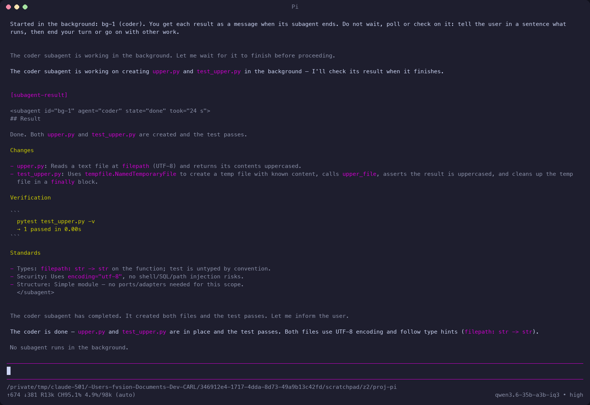
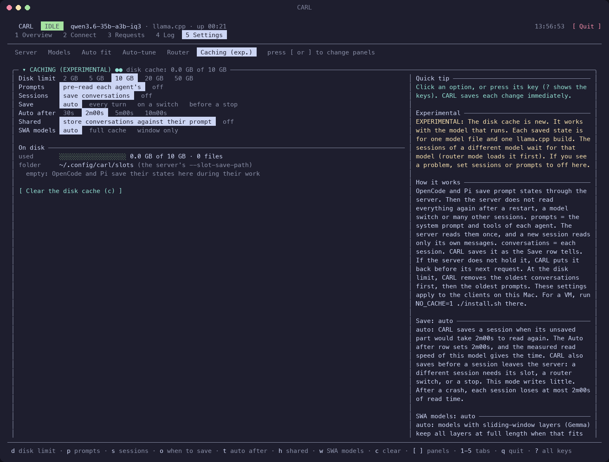

# CARL User Guide

CARL: Can't Afford Remote LLMs.

CARL runs a local coding model (Qwen or Gemma 4) on an Apple Silicon Mac. You use the model from OpenCode or Pi. This guide tells you how to set up, run and use CARL.

- The clients can run on the Mac, in a VMware Fusion VM on the Mac, or on another computer.
- For the technical details (the architecture, the files, the server, thinking, the models, the measurements), see the [reference](reference/README.md).
- For the short overview, see [README.md](README.md).

Commands with the label **Mac** run in the CARL folder on the Mac. Commands with the label **VM** run in the VM. Without a VM, all commands run on the Mac.

## Contents

1. [First-time setup](#1-first-time-setup)
2. [Daily use](#2-daily-use)
3. [Choosing a model](#3-choosing-a-model)
4. [Thinking on, off and effort](#4-thinking-on-off-and-effort)
5. [Context: how much a slot holds](#5-context-how-much-a-slot-holds)
6. [Working in OpenCode and Pi](#6-working-in-opencode-and-pi)
7. [Fast starts: the disk cache](#7-fast-starts-the-disk-cache)
8. [Context memory: q4 or q8](#8-context-memory-q4-or-q8)
9. [Downloading and adding models](#9-downloading-and-adding-models)
10. [The dashboard](#10-the-dashboard)
11. [Updating the client configs](#11-updating-the-client-configs)
12. [Troubleshooting](#12-troubleshooting)
13. [Benchmarking and testing](#13-benchmarking-and-testing)
14. [Rules of thumb](#14-rules-of-thumb)
15. [Command reference](#15-command-reference)

---

## 1. First-time setup

### Requirements

| Item | Requirement |
|---|---|
| Mac | An **Apple Silicon** Mac. A 36 GB Mac runs all models of the catalogue. A 24 GB Mac runs the IQ3 and Q3 builds and the smaller Gemma 4 models ([Sharing with a friend](#sharing-with-a-friend)). A 16 GB Mac runs `gemma-4-e4b`, `gemma-4-12b` and `qwen3.8-9b`. |
| Homebrew tools | [Homebrew](https://brew.sh), for `llama.cpp` (tested with 0.6.0, build 11429; with an older version, the start and the dashboard tell you to update it), `aria2`, `ansifilter` and `zstd` |
| Python | `python3`. The first time that you use it, macOS offers to install it with the command-line developer tools. |
| Swift | The `fit` command uses `swift` to read the exact GPU memory limit. It comes with the command-line developer tools (`xcode-select --install`). |
| Disk space | 4.6–23 GB for each model, and up to 10 GB for the disk cache |
| VM (optional) | VMware Fusion with NAT (vmnet8), for VM clients |

### Set up the Mac

1. Install the tools:
   ```bash
   brew install llama.cpp aria2 ansifilter zstd
   ```
   | Tool | Use |
   |---|---|
   | `llama.cpp` | Gives `llama-server`. CARL cannot run without it. |
   | `aria2` | Makes downloads faster |
   | `ansifilter` | Makes the logs easy to read |
   | `zstd` | Stores a saved session as the changes to its saved prompt, so that it uses less disk space ([the disk cache](#7-fast-starts-the-disk-cache)) |

   - If you forget this step, `./carl.sh` finds the missing tools. It asks to install them with Homebrew.
   - `SKIP_DEPS=1` skips this check.
   - CARL does not install Homebrew itself.
2. Look at the model that **Auto fit** chooses for this Mac:
   ```bash
   ./carl.sh fit
   ```
   The command shows the choice and why. It also shows the largest context of each model that fits the GPU memory limit.
3. Download the model:
   ```bash
   ./carl.sh download default
   ```
   - `default` is Auto fit's choice from the whole catalogue for the everyday goal ([Auto fit](#auto-fit-the-best-model-for-this-mac)).
   - On a Mac with 32 GB or more, the choice is `qwen3.6-35b-a3b`. On a 24 GB Mac, it is `qwen3.6-35b-a3b-iq3`. On a 16 GB Mac, it is `gemma-4-e4b`.
   - If you forget this step, `./carl.sh` tells you that no model is downloaded. It shows Auto fit's choice and its download size, and asks to download it. If you answer no, the dashboard opens without a server.
   - If the choice is not downloaded but a different model is, the server starts with the best downloaded stock model that fits. The start-up output tells you this, and how to download the choice.
4. Start the server:
   ```bash
   ./carl.sh llama            # this Mac only (127.0.0.1): the default
   ./carl.sh llama --vm       # for a VMware Fusion VM client too (fails if Fusion's network is down)
   ```
   - The server starts in the background. Then the **dashboard uses this terminal** ([The dashboard](#10-the-dashboard)).
   - The header of the dashboard shows **LOADING** for 10–60 s, then **IDLE**.
   - The first lines of the output show each setting and where it comes from. For example, for `gemma-4-e4b`:
     ```
     CARL starts the server: gemma-4-e4b (gemma-4-E4B-it-Q4_0.gguf).
     Address: http://127.0.0.1:8080. Only this Mac can use the server.
     Slots: 2 (from Auto-tune). Context: 96K tokens per slot (from Auto-tune).
     Context memory type: q4 (from Auto-tune). RAM cache: 8.0 GiB.
     Speculation: MTP + n-gram, 2 guesses (from Auto-tune). The MTP drafter is mtp-gemma-4-E4B-it-Q4_0.gguf.
     Sliding window: full cache. CARL can restore saved sessions and prompts (cache.swa = auto).
     Log file: ~/models/logs/llama-server-….log. Batch: -ub 512. Your settings: ./carl.sh config show.
     ```
   - The sources of a setting are: your option (a flag), the environment, your settings (`config.json`), Auto-tune, the catalogue, the model file, Auto fit, and CARL's default.
   - If your llama.cpp is older than the version that CARL is tested with, the second line tells you: `llama.cpp 0.4.1 (build 9001) is older than the version that CARL is tested with (0.6.0, build 11429): update it with brew upgrade llama.cpp.` The server starts. The HEALTH card of the dashboard shows the same warning.
   - A refused start shows one `error:` sentence first, then the lines that tell you what to do.
   - `./carl.sh` with no arguments also starts the server, and opens the dashboard ([Daily use](#2-daily-use)).
   - `./carl.sh -h` shows the help. `./carl.sh help llama` (or `./carl.sh llama --help`) shows the options of one command.
5. Install the clients ([Clients on the same Mac](#clients-on-the-same-mac-no-vm)).

**The API key.** The first server start makes the API key, if it is missing.

| Item | Value |
|---|---|
| Key file | `~/.config/carl/api-key`, mode 600, in a folder with mode 700 (the same folder as `config.json`) |
| Configs from the setup | They refer to the key file. They do not contain the key. |
| Key from before 1.2.0 | The first start copies your old key (`~/.mtplx/api-key`) to the new path. It is the same key, so your clients continue to work. |

**The network.** The server serves this Mac only (127.0.0.1) by default.

- For clients in a VMware Fusion VM, start Fusion first. Then start the server with `--vm`. The server then listens on the Fusion NAT address `192.168.42.1`. This address exists only while the Fusion network is up.
- To make the VM the default, set **Network** to **this Mac and the VM** in the Settings tab. Or run `./carl.sh config set llama.net vm`.
- Before 1.3.0, the default was "auto": the VM address when the Fusion network was up. The server was then open to the VM network without a question, so CARL removed this mode. A saved `llama.net = auto` changes to local one time, with a note at the start. `NET=auto` means local.

**The client folder.** At each server start, the launcher writes two files into the `client/` folder: `remote.json` (the server's address, its port and the CARL version) and `api-key`. Both have mode 0600, and git ignores them. The client package for other computers takes them from there ([The client package](#the-client-package)).

### Clients on the same Mac (no VM)

Use this procedure when the server and the clients run on the same Mac, for example the Mac of a friend.

1. Do the steps in [Set up the Mac](#set-up-the-mac).
2. Run the setup:
   ```bash
   ./carl.sh install
   ```
   - It asks one time which clients (OpenCode, Pi or both) and which options you want: the coder subagent, the browser tools, web search and LSP. Press Enter to keep the value in brackets. The defaults are the choices of your last setup.
   - NOTE: web search sends the search queries to Exa (or Parallel), outside this computer.
   - It installs OpenCode and Pi into `~/.local` (no sudo) when they are missing or older. Then it connects them to the server on this Mac.
   - At the end, it tells you what it did, if the server answers, and the next step.
3. Open a new terminal, so that `~/.local/bin` is on the `PATH`.
4. Go to the folder of your project:
   ```bash
   cd ~/path/to/your/project
   ```
5. Start a client there:
   ```bash
   opencode
   ```
   Or run `pi`. The client works on the folder that you start it in.

**Setup options** (`./carl.sh install --help` shows all):

| Command | Does |
|---|---|
| `./carl.sh install --yes` | Takes the defaults. Asks no questions |
| `./carl.sh install opencode` (or `pi`) | Sets up only one client |
| `./carl.sh install --coder off --web-search off` | Gives an answer without the question (also `--browser on\|off`, `--lsp on\|off`, `--coder auto\|on\|off`, `--web-search exa\|parallel\|off`) |
| `./carl.sh install --config-only` | Writes only the configs (the same choices) |
| `./carl.sh install --clients-only` | Installs or updates only the clients |
| `./carl.sh install --vm` or `--host ADDR` | Connects the clients to a different address |
| `./carl.sh install --port N` | Connects the clients to a different llama.cpp port |

- The setup needs `python3`. If macOS asks you to install the command-line developer tools, accept. Or run `xcode-select --install`.
- On the server Mac, the setup uses the server's own key file (`~/.config/carl/api-key`).

**From the dashboard.** The Connect tab (tab 2) does the same, with the choices of your last setup:
1. Push `2` for the Connect tab.
2. Push `i` (**[ Install on this Mac (i) ]**). Or push `u` (**[ Update the model lists (u) ]**) to write only the configs.
3. Push `y` (**[ Run it (y) ]**) to confirm.

The output of the setup shows in the tab.

**Without the setup.** In the dashboard, push `o` (**[ OpenCode config (o) ]**) or `p` (**[ Pi config (p) ]**). The dashboard copies a config for the server to the clipboard, with the URL and the key. Merge it into `~/.config/opencode/opencode.json` or `~/.pi/agent/models.json`.

CAUTION: A config that the dashboard copies contains the API key itself, so that you can paste it on a different computer. Protect this config as you protect the key.

### Clients in the VM

The VM needs Python 3, curl and unzip.

1. **Mac:** start the server for the VM:
   ```bash
   ./carl.sh --vm
   ```
   To make the VM network the default, set **Network** to **this Mac and the VM** in Settings > Server, or run `./carl.sh config set llama.net vm`.
2. **Mac:** make the client package:
   ```bash
   ./carl.sh package
   ```
   CARL writes `dist/carl-client-VERSION-HOST.zip` and shows its path. Or push `z` in the dashboard's Connect tab ([The client package](#the-client-package)).
3. **Mac:** put the zip where the VM can read it, for example the Fusion shared folder:
   ```bash
   cp dist/carl-client-*.zip ~/Documents/
   ```
   In this example, the VM sees the Mac's `~/Documents` folder as `/mnt/data/Documents`. Use the path of your own shared folder.
4. **VM:** unzip it and run the setup:
   ```bash
   cd ~ && unzip /mnt/data/Documents/carl-client-*.zip && cd carl-client && ./setup
   ```
5. Delete the zip on the Mac and in the shared folder: it holds the key. The `carl-client` folder in the VM keeps the key in `api-key` (mode 0600).
6. **VM:** go to the folder of your project, and start `opencode` or `pi` there.

What `./setup` does on the other computer:
- It reads the server's address and key from `remote.json` and `api-key` in the package. It asks no address.
- It asks one time which clients and options you want, as on the server Mac. `./setup --yes` takes the defaults. `./setup --help` shows all options.
- It installs OpenCode and Pi from npm (`opencode-ai`, `@earendil-works/pi-coding-agent`) into `~/.local`, without sudo, when they are missing or older.
  - They need Node 22.19 or newer. If Node is missing or older, the setup downloads Node 22 LTS (Linux or macOS build) from nodejs.org, checks its SHA-256, and puts it in `~/.local/lib/nodejs`.
  - It adds a `PATH` line (marked `# carl-vm-client`) to your `~/.zshrc` or `~/.bashrc`, if the file exists.
- It writes the configs. It keeps your own settings and makes backups ([What the setup changes](#what-the-setup-changes)).
- It keeps the key at `~/.config/carl/api-key`.
- It adds the client sync service. The service applies the config that you send from the dashboard ([Clients on other computers](reference/client-sync.md)). `NO_SYNC_SERVICE=1 ./setup` leaves it out. Keep the `carl-client` folder: the service runs from it.
- On Linux, the service runs only while you are logged in. To keep it running (a VM that you reach by SSH), run `loginctl enable-linger $USER` one time. The setup tells you when this is necessary.
- At the end, it does a smoke test. The line `OK: the server answers at http://192.168.42.1:8080/v1. It has qwen3.6-35b-a3b.` tells you that the connection works. The name is the loaded model.

The client configs are in these files:

| Client | Config files |
|---|---|
| OpenCode | `~/.config/opencode/opencode.json` |
| Pi | `~/.pi/agent/models.json`, `~/.pi/agent/settings.json` |

### Clients on another computer or another VM app

Use this procedure for clients that are not on the server Mac and not in the VMware Fusion VM. Examples: a Parallels VM, or a laptop on your network. The other computer can be a Mac or a Linux computer.

1. Find an address of the Mac that the client can reach:
   - The LAN address: run `ipconfig getifaddr en0`.
   - Parallels: the address of the Mac on the Parallels network, often `10.211.55.2`. `ifconfig` shows it.
2. Start the server on that address:
   ```bash
   ./carl.sh llama --host ADDR
   ```
   Or, in the dashboard, open the Settings tab (tab 5) and select the address in the **Network** row. The row shows each address of this Mac.
3. Make the client package: `./carl.sh package` (or `z` in the Connect tab).
4. Copy the zip to the other computer (for example with `scp`, AirDrop or a USB disk). Then delete it on the Mac.
5. On the other computer, unzip it and run the setup:
   ```bash
   unzip carl-client-VERSION-HOST.zip && cd carl-client && ./setup
   ```
   On a Mac, you can also double-click `setup.command` in the folder. If macOS does not open it (a file from another computer), right-click it and select **Open**, or run `./setup` in Terminal.
6. Delete the zip on the other computer.

- The address must exist on this Mac. The launcher always refuses `0.0.0.0`.
- To use a Parallels address for `--vm`, set `VM_HOST=10.211.55.2`.
- CAUTION: **With the LAN address, every computer on your network can connect to the server.** Only the API key protects it. Do not use the LAN address on a public or shared network.

**To give the address and the key by hand** (a client folder without `remote.json`):
1. Get the key. In the dashboard, open the Connect tab and push `k` to show the key. Or run `cat ~/.config/carl/api-key` on the Mac.
2. Put the key in a file, for example `key.txt`.
3. Run the setup:
   ```bash
   ./setup --host ADDR --key-file key.txt
   ```
4. Delete `key.txt`. The setup keeps its own copy (`~/.config/carl/api-key`, mode 600).

- If you give no key and the folder has none, the setup asks for it. The key does not show when you type it.

### The client package

`./carl.sh package` (or **[ Make the client package (z) ]** in the dashboard's Connect tab) writes one zip for another computer: `dist/carl-client-VERSION-HOST.zip` in the CARL folder. VERSION is the CARL version; HOST is the name of this Mac. Git ignores `dist/`.

| In the zip (folder `carl-client/`) | From |
|---|---|
| The client files | The files of `client/` that git tracks. Never a cache, a backup or a file that git does not track |
| `setup`, `setup.command` | The setup, and its double-click form for macOS |
| `remote.json`, `api-key` | The server's address and key, from its last start (mode 0600) |
| `installed-models.json` | The installed models, for the model lists of OpenCode and Pi |
| `VERSION` | The CARL version. `/carl` shows it under **Sync service** |

- CAUTION: **The zip holds the API key of the server.** Its mode is 0600. Keep it secret. After the copy, delete it on both computers (`rm` with the path that CARL shows). `unzip` keeps the mode 0600 of the key file, and the setup sets it again.
- **When the server serves only this Mac** (network local, 127.0.0.1), other computers cannot reach it. CARL then makes no package, changes nothing, and tells you how to change the network: Settings > Server > Network, or `./carl.sh config set llama.net vm`. Then start the server again, so that `remote.json` has the new address. `--anyway` makes the package also in this case (for example for a test).
- **Before the first server start,** `client/` has no `remote.json` and `api-key`. CARL tells you to start the server one time.
- In the dashboard, **[ Show it in the Finder (f) ]** shows the zip in the Finder.

### Updating a client computer

- **The model lists:** send the config from the dashboard (`P` in the Connect tab). The sync service applies it ([11. Updating the client configs](#11-updating-the-client-configs)).
- **A new CARL version** (new plugins, a new setup): make a new package, copy it, and unzip it over the old folder. Then run the setup again:
  ```bash
  unzip -o carl-client-VERSION-HOST.zip && cd carl-client && ./setup
  ```
  The setup keeps your settings and your choices, and makes backups. `/carl` shows the version of the client package (**Sync service**). It also tells you when the server Mac runs a newer CARL version than the package: the sync service learns the server's version at each contact.
- NOTE: the client folder does not learn about a later CARL update on the server Mac. After you update CARL there, make a new package for each client computer.

### Sharing with a friend

1. Make the zip:
   ```bash
   tools/make-share-zip.sh [--with-docs] [OUT]
   ```
   The command writes `../CARL-YYYYMMDD.zip`, or the file `OUT`. The zip holds one folder, `CARL/`.
   - The zip holds only the files that git tracks. It does not include files that git does not track (test folders, notes), caches, `.DS_Store` files or `*.bak.*` files. It never includes `api-key`, `remote.json` or `installed-models.json`.
   - The development notes (`docs/`) are not in git. `--with-docs` (the first argument) adds them from the disk.
   - The models, the logs and the API key are outside the folder (`~/models`, `~/.config/carl`).
2. On the Mac of your friend, unzip the file.
3. Do the steps in [Set up the Mac](#set-up-the-mac) and [Clients on the same Mac](#clients-on-the-same-mac-no-vm). In short:
   ```bash
   brew install llama.cpp aria2 ansifilter zstd
   ./carl.sh fit
   ./carl.sh download default       # on 24 GB: qwen3.6-35b-a3b-iq3
   ./carl.sh llama
   ./carl.sh install
   ```
   The first server start on that Mac makes a key on that Mac.

**The memory decides the model.** On the other Mac, `./carl.sh fit` gives the real numbers. To see the numbers of a 24 GB Mac from here, run `./carl.sh fit --ram 24`. These are the estimates for a **24 GB** Mac (GPU memory limit about 16 GiB):

| Model | Largest context (q4 context memory) |
|---|---|
| **`qwen3.6-35b-a3b-iq3`** (the default on 24 GB: stock fast MoE, 14.1 GB) | 2 × 96K slots (the default) fit in ~15.0 GiB with n-gram speculation (MTP does not fit), so subagents work. |
| `qwen3.8-27b-iq3` (stock, the smallest 27B, 10.9 GB) | 2 × 96K slots fit in ~15.0 GiB with n-gram speculation, so subagents work. |
| `qwen3.8-27b-q3` (stock, 13.1 GB) | 2 × 64K slots with n-gram speculation (Auto fit's order). ~84K with 1 slot and MTP. |
| `heretic-35b-a3b-iq3` (abliterated fast MoE, 13.6 GB) | 2 × 96K slots fit, so subagents work. It has no MTP head: n-gram speculation. |
| `orcarouter-27b-iq3` (abliterated, the smallest abliterated 27B, 12.6 GB) | 2 × 64K slots with n-gram speculation, so subagents work. |
| `orcarouter-27b-q3` (abliterated, 14.6 GB) | 1 × 64K with n-gram speculation. Its default context is 64K. |
| `qwen3.8-9b` (5.8 GB), `gemma-4-e4b` (4.6 GB) and `gemma-4-12b` (7.2 GB) | 2 × 96K slots fit with MTP (the Gemma models with the window cache) |
| `gemma-4-26b-a4b` (14.6 GB) | 2 × 64K slots with n-gram speculation and the window cache (Auto fit's order). |
| `qwen3.8-27b`, `orcarouter-27b` (Q4) | They do not fit under the default limit. |
| `qwen3.6-35b-a3b`, `heretic-35b-a3b` (Q4), `gemma-4-31b` | They do not fit. |

- `orcarouter-27b-q3` is the one exception to the 96K floor, because this build is for 24 GB Macs. The start tells you this. It suggests `./carl.sh tune orcarouter-27b-q3`, which selects the largest context that fits.
- **Experts only: a larger GPU memory limit.** CAUTION: keep at least 6 GiB for macOS, or the Mac can stop. `sudo sysctl iogpu.wired_limit_mb=18432` gives the GPU more memory until the next restart. Then the stock Q4 `qwen3.8-27b` can run with ~52K and MTP. The abliterated Q4 gets only ~20K: use its Q3.
- **Watch the memory on the Live tab of the dashboard.** The **Pressure** row of the THIS MAC card shows the macOS memory pressure. If it says `warning` or `critical`, use a smaller `--ctx`.
- **The launcher refuses a model and a context that do not fit.** It shows what they need and the GPU memory limit. It also shows the largest context that fits, and Auto fit's choice. `FIT_CHECK=0` is the expert override.
- With 1 slot, the setup does not install the coder subagent, unless the coder runs on an external model ([The coder subagent](#the-coder-subagent-opencode-and-pi)).
- NOTE: These estimates did not get a test on a 24 GB Mac.

---

## 2. Daily use

1. **Mac:** for VM clients, start Fusion.
2. **Mac:** start CARL:
   ```bash
   ./carl.sh
   ```
   | Situation | What `./carl.sh` does |
   |---|---|
   | A server runs on port 8080 | The dashboard attaches to it. |
   | No server runs | It starts llama.cpp with your saved settings, then shows the dashboard. |
   | No model is downloaded | It first offers to download Auto fit's choice for this Mac. |
3. **VM or Mac:** go to the folder of your project, then run `opencode` or `pi` there. The client works on the folder that you start it in.
4. In the client, select the model that the server runs: `/models` in OpenCode, `/model` in Pi.
   - The lists show the models that are installed on the server, under their own names.
   - This step is necessary only if the server's model is not the clients' default.
   - If you select a different model, OpenCode shows a CARL warning. In [router mode](#router-mode-switch-models-from-opencode-or-pi), your selection loads that model.

**Other ways to start:**

| Command | Does |
|---|---|
| `./carl.sh --no-start` (or `./carl.sh dashboard`) | Opens only the dashboard. It attaches to a server that runs. If no server runs, it starts nothing. Push `a` on the Live tab to start the server. Or select a model in the Settings tab, and push `a` there. |
| `./carl.sh llama --model qwen3.8-27b` | Starts a specific model ([Choosing a model](#3-choosing-a-model)) |
| `./carl.sh monitor` | Attaches the dashboard to a server that runs |

CAUTION: **The server does not start if another model is in memory.** Two models do not fit. The launcher looks for each process larger than 8 GiB, and shows it.

### Stop the server, or keep it running

1. In the dashboard, push `q` (or Ctrl-C, or click **[ Quit ]**).
2. Select one option:

   | Key | Option |
   |---|---|
   | `s` | **Stop the server and quit** |
   | `l` | **Leave it running and quit.** The server continues to run after you close the terminal. |
   | Esc | **Cancel** |

- To attach the dashboard again, run `./carl.sh` (or `./carl.sh monitor`).
- If an agent's turn is running, Stop asks first: wait for the end of the turn, or stop now ([A turn is running](#a-turn-is-running)).
- To stop the server without the dashboard, run `./carl.sh monitor`, then push `q` and `s`. Or run this command. It finds the process that listens on port 8080:
  ```bash
  kill $(netstat -anv -p tcp | awk '$6=="LISTEN" && $4 ~ /[.]8080$/ {n=split($(NF-8),a,":"); print a[n]; exit}')
  ```

### What to expect

| Situation | What occurs |
|---|---|
| The first message of the first session | The server reads the system prompt and the tools of OpenCode, about 9K tokens. This takes about 13–20 s on the 35B and about 2 min on the 27B. The [disk cache](#7-fast-starts-the-disk-cache) then saves this prompt. |
| A new session later | The disk cache puts the saved prompt back. The first answer starts in under a second, not after 13–20 s (35B) or about 2 min (27B). |
| A long session after a server restart | The disk cache puts the session back. The next answer starts in about a second. Without the cache, the server reads the whole session again. A 64K-token session then takes about 5 min on the 35B. A 56K-token session takes about 16 min on the 27B. |
| Follow-up turns | They are fast. The server uses its RAM cache and its slots again, and reads only the new tokens. |
| The Mac on battery power with the lid closed | The Mac sleeps, and all requests in progress pause. The Mac stays awake while the server runs (`caffeinate`), but not with the lid closed on battery. Connect the power supply for long work. |

The times in this table come from these measurements: the 35B IQ3 on an M2 Max 32 GB (llama.cpp 0.5.0, 2026-10-03 and 2026-10-04), and the 35B Q4 and the 27B on an M3 Pro 36 GB (llama.cpp 0.4.1, 2026-09-24 to 2026-10-01). A different Mac gives different times. [Caching](reference/caching.md#measurements) and [Context length](reference/memory.md#context-length-what-a-larger-context-costs) give the details.

---

## 3. Choosing a model

Each model has its own name on the server, and the clients list it under the same name. (Before 1.3.0, the builds of one family shared a name, so the label could be wrong.)

| You want | Run on the Mac | Select in the client |
|---|---|---|
| **The default:** Qwen3.6-35B-A3B (MoE: about 4× the write speed and 6× the read speed of the 27B) | `./carl.sh llama` | `qwen3.6-35b-a3b` |
| The dense 27B (stock), for hard code | `./carl.sh llama --model qwen3.8-27b` | `qwen3.8-27b` |
| The uncensored (abliterated) 27B, with the best measured quality in long sessions | `./carl.sh llama --model orcarouter-27b` | `orcarouter-27b` |
| Uncensored and fast: the abliterated A3B (Heretic, Q4 with the MTP head; 32 GB+) | `./carl.sh llama --model heretic-35b-a3b` | `heretic-35b-a3b` |
| A 24 GB Mac (the default on that Mac) | `./carl.sh llama` (it selects `qwen3.6-35b-a3b-iq3`) | `qwen3.6-35b-a3b-iq3` |
| A 24 GB Mac, stock 27B | `./carl.sh llama --model qwen3.8-27b-q3` | `qwen3.8-27b-q3` |
| A 24 GB Mac, stock, the smallest 27B (10.9 GB) | `./carl.sh llama --model qwen3.8-27b-iq3` | `qwen3.8-27b-iq3` |
| A 24 GB Mac (or any Mac), uncensored and fast | `./carl.sh llama --model heretic-35b-a3b-iq3` | `heretic-35b-a3b-iq3` |
| A 24 GB Mac, uncensored 27B with subagents (2 × 96K) | `./carl.sh llama --model orcarouter-27b-iq3` | `orcarouter-27b-iq3` |
| A 24 GB Mac, uncensored 27B, better quality (1 slot) | `./carl.sh llama --model orcarouter-27b-q3` | `orcarouter-27b-q3` |
| **A 16 GB Mac**, fast (Auto fit's everyday choice there) | `./carl.sh llama --model gemma-4-e4b` | `gemma-4-e4b` |
| **A 16 GB Mac**, better code, slower (Auto fit's hard code choice there) | `./carl.sh llama --model gemma-4-12b` | `gemma-4-12b` |
| 3–4 subagents at the same time on a small model | `./carl.sh llama --model qwen3.8-9b` | `qwen3.8-9b` |
| Google's larger Gemma 4 ([Gemma 4](#gemma-4)) | `./carl.sh llama --model gemma-4-26b-a4b` (or `gemma-4-31b`) | the same name |

**Key points:**
- CAUTION: **Only one model can run at a time.** Stop the server before you start a different model. Two models do not fit in 36 GB, and the second model breaks the model that runs.
- **By default, the client does not change the server's model.** llama-server answers with the loaded model, for each model name that the client sends. If the selection and the server do not agree, you get the loaded model with the wrong label and the wrong thinking options. OpenCode then shows a CARL warning. Router mode (below) is the other way round.
- **In single-model mode, the clients list only the model that the server runs.** The server answers with its one model, so the other models are of no use in the list. When you start a different model, update the lists: push `u` in the dashboard's Connect tab (this Mac), or run `./carl.sh install --config-only`. For other computers, push `P` (send the config). The Connect tab warns when the lists are out of date.
- **In router mode, the clients list all the installed models** (downloaded, or in the models folder), one entry each. After a download or a delete, update the lists in the same way.
- **Stock or abliterated:** the stock models (`qwen3.8-27b`, the 35B, the 9B, Gemma 4) keep their refusals. The orcarouter and Heretic builds have no refusals. Only `orcarouter-27b` has full measurements in CARL. The stock 27B has the same architecture and speed profile.
- **Q3 or Q4:** Q3 is 2.5–3.5 GB smaller, but its quality is lower (more slips in long agent sessions). Use Q3 if Q4 does not fit.
- **IQ3:** the IQ3 builds are smaller again, and their quality is lower again. The IQ formats unpack more slowly on Metal. MTP helps them less, and 2 guesses make them slower. Thus, their recommended speculation is MTP + n-gram with 1 guess ([IQ3 speculation](reference/models.md#iq3-speculation-measured-2026-10-03)). Use IQ3 only if nothing larger fits.
- **The 9B** (`qwen3.8-9b`, 5.8 GB) is empero-ai's community distillation of Qwen3.8 into a 9B. It is not an official Qwen release: Qwen publishes no 9B in the 3.8 line.
  - It is the one Qwen model that fits a 16 GB Mac with 2 × 96K.
  - It writes at ~25 tok/s on an M2 Max 32 GB (llama.cpp 0.5.0, 2026-10-03). The Qwen3.6/3.8 hybrid layers are slow on Metal (llama-bench without CARL's flags agrees).
  - Where the 35B-A3B IQ3 fits, the IQ3 is faster and better, also for several subagents at the same time.
  - Thinking is on or off only.
- **More slots (3–4)** run more subagents at the same time.
  - The Server panel offers 3 and 4 only when they fit this Mac with the selected model, context and context memory type.
  - CARL stops at 4, because each request becomes slower as more requests run at the same time. The 9B (M2 Max, 2026-10-03): 25 tok/s alone, 41 tok/s in total with 4 (~10 each). 8 would fit, but at ~6 tok/s each.
  - The parallel step of Auto-tune measures this for each model.
- **Other models:** each `.gguf` in `~/models/gguf` is a model too ([Downloading and adding models](#9-downloading-and-adding-models)).

### Gemma 4

The catalogue has four Gemma 4 models from Google. Each one is Google's QAT build in Q4_0 (ggml-org).

| Model | Size | For |
|---|---|---|
| `gemma-4-e4b` | 4.6 GB | Small and fast, for any Mac from 16 GB. 2 × 96K with the full cache needs ~8.2 GiB. Weaker on hard code. |
| `gemma-4-12b` | 7.2 GB | The dense 12B: much stronger than the E4B on code (Google: LiveCodeBench 72% vs 52%), for any Mac from 16 GB. 2 × 96K with the window cache needs ~8.6 GiB with n-gram, ~10.2 GiB with MTP (16 GB Macs: n-gram). The full cache with MTP needs ~30.8 GiB. |
| `gemma-4-26b-a4b` | 14.6 GB | The MoE (3.8B active), for fast everyday coding. 2 × 96K with the full cache fits a 36 GB Mac. On a 32 GB Mac it gets 2 slots with the window cache. |
| `gemma-4-31b` | 18.0 GB | The dense 31B, for hard code when you can wait. It runs with the window cache on 32 and 36 GB Macs. |

- **Ranks 6–9**, below the Qwen 27B and 35B-A3B builds: Qwen is better at agent coding in the published benchmarks. On 16 GB Macs Auto fit chooses the E4B (everyday) or the 12B (hard code).
- **Sliding window.** Most Gemma layers look only at the last 1,024 tokens (the E4B: 512).
  - With the **full cache**, those layers keep every token. CARL can restore saved sessions and prompts, but the cache uses much more memory.
  - With the **window cache**, they keep only the last window. It uses less memory, but CARL cannot restore saved sessions and prompts.
  - The setting `cache.swa` decides this: the **Sliding window** row of Settings > Server, or the **Gemma models** row of Settings > Caching ([Models with sliding-window layers](#models-with-sliding-window-layers)).
- **Speculation: MTP with a drafter.** Gemma 4 has no MTP head in the model file. Google gives a separate drafter file for each model (`mtp-gemma-4-*.gguf`, 60–280 MB). `./carl.sh download NAME` gets the model and its drafter. A start gives the drafter to llama.cpp (`-md`).
  - The catalogue uses MTP + n-gram with 2 guesses. MTP makes new text faster, and n-gram makes edits faster. Measured on all four models (2026-10-04): 55% to 85% faster than no speculation ([the numbers](reference/models.md#gemma-4)).
  - If the drafter is not downloaded, the start uses n-gram speculation and tells you. Run `./carl.sh download NAME` again to get the drafter.
  - A Gemma 4 model from another Hugging Face repository (for example a fine-tune) also gets a drafter: the drafter of the catalogue model with the same size. `./carl.sh download hf:…` gets it with the model. For a custom Gemma 4 model that you have already, run `./carl.sh download NAME`, or press d on it in Settings > Models.
- **Sampling:** Google's values: temperature 1.0, top_p 0.95, top_k 64.
- **Thinking:** on or off only.
- **Images:** the models can read images, but CARL starts them text-only.
- More: [Gemma 4](reference/models.md#gemma-4).

### Router mode: switch models from OpenCode or Pi

Router mode is for users who prefer to change models during the work. llama.cpp's router then offers every downloaded model that fits this Mac. It loads the model that OpenCode (`/models`) or Pi (`/model`) asks for.

- One model is in memory at a time. The loaded model stops first.
- A switch takes 30 s to 2 min.
- The default is **single model**: one model runs. Auto fit or you choose it in the Settings tab.

WARNING: After a switch, the new model has none of the sessions in memory. A saved session belongs to the model it ran on. When you switch back to that model, OpenCode and Pi restore the session from the [disk cache](#7-fast-starts-the-disk-cache) (with Saved sessions on, and for a Gemma model the full cache). A session that continues on the new model is read again: minutes for a long session. Keep this in mind before you switch.

**To turn router mode on:**
1. In the dashboard, push `5` for the Settings tab.
2. Push `]` until the **Router** panel shows.
3. Push `r`, or click **Router mode: OpenCode and Pi switch (r)**.
4. Push `y` (**[ Switch (y) ]**) to confirm (**SWITCH TO ROUTER MODE?**).

The dashboard saves `llama.mode = router` in `config.json`, and restarts a server that runs. Then it updates the OpenCode and Pi configs on this Mac (when CARL set them up here). On other computers, send the config (`P` in the Connect tab), or run `./setup` again there.

Other ways:

| Command | Does |
|---|---|
| `./carl.sh --router` | Router mode for this start only |
| `./carl.sh config set llama.mode router` | Router mode for each start |
| `s` in the Router panel (**Single model (s)**), or `./carl.sh --single` | Back to single model |

**How the router works:**
- **Each model gets the settings that a single start of it uses:** your `config.json` profile, else its Auto-tune result, else the catalogue. This includes the context, the slots, the context memory type, the speculation, the sampling and the RAM cache.
- A model whose setup does not fit the GPU memory limit is left out. The start tells you why.
- `--model`, `--ctx`, `--kv` and `--slots` do not apply to a router start.
- The launcher writes the presets to `~/.config/carl/router-presets.ini` at each start. Do not edit this file.
- **The model that loads first** is the model that a single start loads (`llama.model`, or Auto fit's choice).
- **The Router panel** (router mode only) lists the models that the router offers, with their state, their slots and context (`2 × 96K`), and **[ Load ]** or **[ Unload ]**. Push ↑ ↓ to select a model, and Enter to load or unload it. The panel also shows the recent switches.
- The panel also tells you if the OpenCode and Pi configs on this Mac list the installed models (router mode) or the model that the server runs (single-model mode). **[ Update the OpenCode and Pi configs (u) ]** runs the setup for this Mac. The Connect tab shows its output.
- **A model that is not installed** gets an error (HTTP 400 "not found"), and nothing loads. OpenCode shows a CARL warning.
- **Custom models:** set the *thinking* field of the card (Models panel, `e`), so that OpenCode offers the correct levels.
- The dashboard follows the loaded model (memory, context, requests). The header shows `router mode (N models)` after the model name.

---

## 4. Thinking on, off and effort

The models "think" (hidden reasoning) before they answer. More thinking makes the model slower, but the answers to difficult problems are better.

### OpenCode: `/variants` (or ctrl+t)

In OpenCode 1.18, the thinking levels are model **variants**. Type `/variants` and select one, or push **ctrl+t** for the next one. The current variant shows next to the model name. `/models` changes the model.

| Model | Variants | Default |
|---|---|---|
| The 27B builds (`qwen3.8-27b…`, `orcarouter-27b…`) | `none` = off, `low`, `medium`, `xhigh` | `low` |
| The 35B-A3B builds (`qwen3.6-35b-a3b…`, `heretic-35b-a3b…`), the 9B, Gemma 4 | `none` = off, `high` = on | `high` |
| A model that you added | From the *thinking* field of its card ([Cards for custom models](#cards-for-custom-models)): on / off (`none`, `high`), or effort levels (as the 27B). Without a card value, CARL reads it from the GGUF header. | |

### Pi: thinking level

| Model | Levels |
|---|---|
| The 27B builds | off, low, medium, xhigh |
| The 35B-A3B builds, the 9B, Gemma 4 | off, high |

The setup sets the Pi defaults: provider `llamacpp`, the default model ([What the setup changes](#what-the-setup-changes)), and thinking `low`. It sets them only if they are unset, or if they still have the values that it set before.

### The main session and the coder: a setting for each

Each model has two thinking settings in the dashboard (Settings > Agents, [Agents panel](#agents-panel)): **Main thinking** (the main session of OpenCode and Pi) and **Coder thinking** (the coder subagent). You set them independently, as the coder already has its own temperature (0.6).

| Model | Main thinking: values (default) | Coder thinking: values (default) |
|---|---|---|
| The 27B builds (effort levels) | off, low, medium, xhigh (low) | same as main, off, low, medium, xhigh (same as main) |
| The 35B-A3B builds, the 9B, Gemma 4 (on / off) | off, on (on) | same as main, off, on (same as main) |

- **The default of Coder thinking is "same as main"** (`main` in `config.json`): the coder thinks as the main session does with the model that it runs on. Main thinking keeps the value that CARL used before these settings were available.
- **On is good for a coder.** A coder solves problems, and thinking helps it. On a 27B build, "on" for the coder is `medium`. Turn its thinking off only when you give it a full spec (spec-kit or a similar tool): a coder without thinking does well only when every requirement is written down. The dashboard shows this note when the coder thinks off (Coder thinking off, or same as main with Main thinking off).
- The coder's setting applies to each coder session, also to the test session before the code ([The chain](reference/delegation.md)). It follows the model that the coder runs on.
- **The clients get the settings at the next update:** the Connect tab, `u` (this Mac), or `P` (other computers that sync). The dashboard saves a change at once; the server does not restart.
- **One computer can have its own Coder thinking:** `/carl` > **Coder subagent** > **Coder thinking** ([The /carl panel](#carls-plugins-and-extensions)). That choice is stronger than the dashboard's value on that computer, for that model: the model of the session that you open `/carl` in. The setup and the sync keep it (`CODER_THINKING` in `~/.config/carl/client-install.env`). Its value `dashboard default` removes it again.
- **OpenCode:** Main thinking is the default of each model entry (`options.reasoningEffort`). A variant that you select (`/variants`, ctrl+t) is stronger than it. For Coder thinking, CARL's `carl-delegation` plugin sets the thinking on each request of the coder, for the model of the request. With "same as main", it does not change the request: the model's own setting (Main thinking) applies.
- **Pi:** Main thinking that is not the default goes into `modelThinkingLevels` in `settings.json` (one level for each model). If you change a level there yourself, the setup keeps your level. Coder thinking goes into `~/.pi/agent/carl.json`. The subagent extension uses the value for the model of the coder when it starts the coder. With "same as main", the coder gets the thinking level of the session.
- **Off** turns thinking off only. The sampling settings stay those of the server.

**Notes:**
- **A change applies from the next message.** A reply in progress keeps its mode.
- **After the setup runs again, fully restart OpenCode.** An open OpenCode keeps its old options. If OpenCode does not know an option, it uses the default without a warning.
- **Use `xhigh` only when necessary.** With `xhigh`, Qwen3.8 thinks too much on simple tasks. `low` is the correct default for agent work on the 27B.
- **The 35B has no effort levels,** only on and off. Its template ignores low, medium and xhigh. Thus, only `none` and `high` are available.
- **The sampling settings follow the mode:**

  | Mode | Sampling |
  |---|---|
  | Thinking on (Qwen) | temperature 1.0, top_p 0.95, top_k 20 |
  | The OpenCode `none` variant | Qwen's non-thinking values: temperature 0.7, top_p 0.8, presence penalty 1.5 |
  | The Pi `off` level | The thinking values stay. |

  To change the server defaults, run `TEMP=0.6 ./carl.sh llama`. If the 35B repeats itself, use `PRESENCE=1.5`. More: [Sampling](reference/sampling.md).
- **How "off" works:** the server loads the chat template of the model with one added rule. With this rule, `reasoning_effort: none` means `enable_thinking: false`. To use the template without the rule, run `THINK_TOGGLE=0 ./carl.sh llama`. More: [Thinking](reference/thinking.md).

---

## 5. Context: how much a slot holds

The context is the number of tokens that one slot can hold: the session, its tool results and its answers.

- The default is 96K tokens for each slot.
- 96K is a floor: CARL does not select less if 96K fits. Agent work needs that much context.
- The one exception is `orcarouter-27b-q3`, a build for 24 GB Macs. It starts at 64K and suggests a tune.
- The Settings tab warns only about a larger context (in the very slow zone).

A larger context works (the recall test stayed 8/8 up to ~150K), but it needs more time. When the server must read a full context again (a cold read), the 35B needs these times (M3 Pro 36 GB, llama.cpp 0.4.1, 2026-10-01):

| Context | Cold read | Write speed |
|---|---|---|
| 64K | ~5 min | 20 tok/s |
| 128K | ~19 min | 14 tok/s |
| 150K | ~27 min | 12 tok/s |

Use `--ctx 128k` or `--ctx 160k` when you need it. More: [Context length](reference/memory.md#context-length-what-a-larger-context-costs).

```bash
./carl.sh --ctx 192k      # larger: N or Nk, from 4k to 256k
./carl.sh --ctx 96k       # smaller: less memory
```

**After you change `--ctx`, update the clients:**
1. **Mac:** run `./carl.sh install --config-only`.
2. **Other computers:** send the config (`P` in the Connect tab). Or run the setup again in the client folder. It reads the context of the server that runs:
   ```bash
   cd ~/carl-client && ./setup --yes --no-install
   ```
3. Restart OpenCode or Pi.

**Why this is important:**
- **The client limit decides only when the client compacts** (summarises) the session. The client does not send this limit to the server.
- **If the client has 128K but the server has 96K,** all requests fail when the session is larger than 96K. The error is `HTTP 400 ... exceeds the available context size`. The client never compacts, because it did not get to its own limit.
- **A server context that is larger than the client limit causes no problem.** It only uses memory that the client does not use.
- **The setup sets the client limit** from the server that runs, or from `LLAMA_CTX=128k ./carl.sh install` (`LLAMA_CTX=128k ./setup` on other computers). If the server is down, it uses 96K.

**Memory:**
- The server allocates all of the context memory at the start. The 27B at 128K: about 2.25 GiB with q4, 4.25 GiB with q8. The 35B: 720 MiB and 1.33 GiB.
- 192K with q4 fits on a 36 GB Mac. If you use a larger context, keep the memory of the VM small.

---

## 6. Working in OpenCode and Pi

### Subagents

OpenCode and Pi run a subagent as a separate session (a child session).

- **By default, the server keeps two slots** (if they fit). The main session and a subagent each keep their own cache.
  - When the subagent is complete, the main session continues in about a second. It does not read its full context again. With one slot, the main session read everything again: this took minutes on the 27B at 60K tokens.
  - The start lines show `Slots: 2 (auto: two slots fit). Context: 96K tokens per slot (…).`
  - `--slots 1` sets one slot (less memory). `./carl.sh fit --slots 2` shows what fits.
- **Two at the same time:** a subagent can run while the main session keeps its place. OpenCode can also run two subagents at the same time.
  - On the 35B, two requests at the same time write ~39% more tokens in total (M3 Pro, 2026-10-01).
  - On the 27B, the two requests share the GPU. Each one runs at about half speed.
- **The title agent of OpenCode stays on.** With 2 slots, it runs at the same time as the main session. It does not wait behind the main session.
- **The dashboard:** the SLOTS card of the Live tab shows one bar for each slot. When both slots work, the header shows **BUSY ×2**.
- **More than two sessions at the same time** (for example, two subagents and the main session): the server puts the extra session in the RAM cache. The size of that cache comes from the free memory, so the session possibly does not fit. Then the server reads it again.

### The coder in the background

The coder subagent runs in the background, in OpenCode and in Pi.



1. The main agent starts the coder and tells you what it does.
2. The main session is then free. You can ask it other things while the coder works in the other slot.
3. When the coder ends, its result comes back to the main session as a message. When CARL ran the tests first in their own session, this is one message for both sessions.
   - In Pi, the message shows as `✓ Coder finished (42 s)` with the first 3 lines of the result. Push Ctrl+O to see all of it. A coder that failed shows `✗ Coder failed (…)`.
4. The main agent then checks the result.

Local models often ignore an instruction to use the background. Thus, CARL starts its coder in the background, unless the model asks for the foreground:
- OpenCode: the `carl-background` plugin.
- Pi: the `subagent` tool. In Pi, `/subagents` lists the subagents that run and stops one. The footer shows how many run.

`NO_BACKGROUND_SUBAGENTS=1 ./carl.sh install --config-only` (`./setup` on other computers) turns the background off. `NO_BACKGROUND_SUBAGENTS=0` turns it on again.

### The Subagents panel (OpenCode)

In OpenCode, the sidebar shows a Subagents panel.

| Part | What it shows |
|---|---|
| The running subagents, at the top, oldest first | A spinner, the agent and the task, the time, and the tool that runs now |
| The finished subagents, below, newest first | ✓ (complete) or ✗ (error), the agent, the task and the duration, one line each. The panel shows the 5 newest, for 5 minutes after they end. |
| `+N more` | The other finished subagents. Click it to see all of them. |

- When you go to a different parent session, the panel shows the subagents of that session.
- Click a subagent to see its model and its context size. Click it again to open its session.
- Click the panel header to collapse the panel.
- To get a new version of the panel, run the setup again. Then restart OpenCode.
- The plugin is `client/opencode/plugins/subagents-sidebar/`. The setup registers it in `~/.config/opencode/tui.json`. `NO_SIDEBAR=1 ./carl.sh install --config-only` installs without it.

### Switching sessions (OpenCode)

OpenCode 1.18.34 does not show the open sessions as tabs. Thus, the setup adds a session switcher to the right side of the prompt box:

```
‹ 2/3 ● fix the log parser ›
```

| Part | Meaning |
|---|---|
| `2/3` | The place of this session in the list. The newest session is first. |
| `●` `!` `○` | The state of the session: busy; waits for a permission or a question; idle |
| `‹` `›` | Click to go to the previous or the next session. |
| The title | Click it to open a list of the sessions. Select one, and push Enter. `/switch` opens the same list. |
| `+1●` after the title | Another session is busy. |

- The list contains the top-level sessions of this project that changed in the last 72 hours (at most 9). It does not contain subagent sessions. For older sessions, use `/sessions`.
- The switcher does not show when there is only one session.
- The plugin is `client/opencode/plugins/session-switcher/`. The setup registers it in `~/.config/opencode/tui.json`. `NO_SWITCHER=1 ./carl.sh install --config-only` installs without it.

### Tools in OpenCode and Pi

`./carl.sh install` gives OpenCode and Pi as many tools as fit a small prompt. As installed, OpenCode's system prompt and tool definitions are **9,870 tokens** (Qwen3.6 35B-A3B, OpenCode 1.18.34). The target is less than 10.5K, because each new session reads them first.

| Tool | OpenCode | Pi | Switch |
|---|---|---|---|
| read, edit, write, bash, grep, glob / find / ls, task, todowrite, question, skill, webfetch | Built in | read, edit, write, bash, **grep, find, ls** (Pi has the last three off; CARL turns them on) | |
| **Web search** | `websearch` (Exa) | `web_search_exa`, `web_fetch_exa` (MCP) | `WEB_SEARCH=exa\|parallel\|off` |
| **LSP** (go to definition, references, diagnostics) | `lsp`, with `"lsp": true`. OpenCode downloads and runs the language servers that it needs. | | `NO_LSP=1` |
| **Browser** (a real Chrome: open pages, click, type, fill forms, screenshots, console and network) | The **browser** subagent | The `carl-browser` MCP server, loaded when necessary | `NO_BROWSER=1`, `BROWSER_HEADED=1` (show the window) |
| **Background subagents** | The task tool can run a subagent in the background. CARL's coder always does (`carl-background`). | The `background` option of the `subagent` tool. CARL's coder always uses it. `/subagents` lists and stops them. | `NO_BACKGROUND_SUBAGENTS=1` |
| **Parallel tool calls** | Several tool calls in one turn. llama.cpp needs the request to ask for them: CARL's OpenCode model entries do. | | |

Answer the questions of the setup, or put a switch in front of it, for example `WEB_SEARCH=off ./carl.sh install --config-only` (`WEB_SEARCH=off ./setup` on other computers). The setup keeps your choices for the next time.

- CAUTION: **Web search sends data out of this computer.** The search queries go to Exa (`mcp.exa.ai`, no account necessary) or to Parallel (`search.parallel.ai`). Everything else stays local. `WEB_SEARCH=off` turns web search off.
- **The browser runs in a temporary profile** (`--isolated`). It is not logged in to a site, and nothing stays after it closes.
  - On a Mac with Google Chrome, it uses that Chrome. On other computers, it uses Playwright's Chromium. Install it one time with `npx playwright install chromium` (about 150 MB).
  - It runs without a window, unless `BROWSER_HEADED=1`.
  - The package is pinned (`@playwright/mcp@0.0.83`). npx gets it the first time.
- **Why a browser subagent:** the 26 browser tools are ~4.8K tokens.
  - In the main agents, they would make each first request read 14.5K tokens.
  - In a subagent, they cost the main prompt one short description.
  - The main agent sends browser work to the subagent when a task needs a live page. Examples: a check of a web app that it changed, or a page that webfetch cannot read.
  - You can also write `@browser ...`.
  - In Pi, `tool_search` loads the browser tools when necessary.
- **How OpenCode gets the switches:** OpenCode reads them only from environment variables. Its config file has no keys for them.
  - The setup writes them to `~/.config/carl/opencode.env`.
  - It adds a marked 3-line pointer to your `~/.zshrc` or `~/.bashrc` that loads this file. It makes a backup first, and changes nothing else in the file.
  - It never makes a new profile file. Without one, it shows the line to add.
  - Before it writes, it tells you which file it changes. For a symlinked profile, it changes the target of the link.
  - `NO_PROFILE=1` keeps your profile as it is, and shows the line to add.
  - Open a new terminal after the setup. An OpenCode that you start in a different way (not from a shell) does not see the switches.
- **Background subagents** and **LSP** are experimental features of OpenCode (`OPENCODE_EXPERIMENTAL_BACKGROUND_SUBAGENTS=1`, `OPENCODE_EXPERIMENTAL_LSP_TOOL=1`). Web search uses `OPENCODE_ENABLE_EXA` (or `OPENCODE_ENABLE_PARALLEL`) and `OPENCODE_WEBSEARCH_PROVIDER`. The setup removes the pointer when all these switches are off.

### The coder subagent (OpenCode and Pi)

The setup adds a specialist **coder** subagent, and a rule that tells the main agent when to use it.

- With the answer `auto` (the default), it does this **only when the server has 2 or more slots.** With one slot (for example a 24 GB Mac with a 27B), each delegation removes the main session from its slot. The server then reads it all again. Thus, the setup does not install the coder, or removes it.
- The setup checks the server that runs. Run it again after you change the model or the slots.
- The answer `on` (`--coder on`, or `CODER=1`) installs the coder in all conditions. `off` (`--coder off`, or `NO_CODER=1`) never installs it.

**When the main agent uses the coder.** The main agent delegates **on its own**, in these conditions:
1. **It is stuck:** a fix for the same code failed two times. These are its own attempts, or attempts that you tell it failed.
2. **The task is large:** 3 or more files, or ~150 or more lines. Examples: a new module, package or CLI, an implementation with tests, a multi-step feature or refactor.

For a large task, the main agent can first read what the brief needs (the files to change, the test command, the project's rules), but it does not write or change files itself. Then it delegates.

The main agent keeps the questions, the explanations, the code searches and the small edits.

**The reminder.** Local models often forget the rule after they read some code. Thus, CARL adds one line to the end of each of your messages in the main session: `[CARL reminder] Large coding work or a fix that already failed goes to coder …`. The line is the same each time, so the caches stay valid. In the tests, it moved the most large and stuck tasks to the coder. `NO_REMINDER=1 ./setup --yes` turns it off (`./carl.sh install` on the server Mac).

**`/code TASK`** gives a task straight to the coder. The main agent does not decide: it writes the brief and hands it on at once.

**How the main agent writes the task.** The coder sees only the task. The main agent writes it as a brief in TOML, from your request and the project's files: `work_mode` (`code`, or `tests-only` for tests only), `work_type` (`new_feature`, `follow_up` or `bug_fix`), the tests that already cover the work, the request in a few sentences (`task_summary`), what the finished work looks like for you (`expected_outcome`), what exists now (`current_state`), how to build it (`design_notes`), the names, commands and formats of your request, copied exactly (`exact_interfaces`), limits in plain words (`scope_limits`), documents to read first, the files it knows of (the list does not have to be complete), the requirements with ids (R1, R2, ...), the checks that cover them, the project's rules, real input, and for a fix that failed, the error and what was tried. A short example:

```toml
work_mode = "code"
work_type = "new_feature"

task_summary = "Notes are getting due dates, so the user can see what is late and what comes next."
expected_outcome = "A note can have a due date. `notes list` shows it after the text."
exact_interfaces = ["notes add TEXT --due 2026-11-01"]

[[known_file]]
file_path = "notes/model.py"
file_action = "change"

[[task_requirement]]
requirement_id = "R1"
requirement_text = "A note has an optional due date (YYYY-MM-DD)."

[[acceptance_check]]
check_id = "C1"
covers_requirements = ["R1"]
run_command = "python -m pytest tests/test_model.py"
expected_result = "all tests pass"
```

**CARL checks the brief.** Before the coder starts, CARL checks that the brief is complete. For example, each requirement must be in a check with a command, a code task must name at least one file to create or change, and a follow-up or a fix must say what exists now. A key of the older brief (such as `mode` or `goal`) is refused with the name of the new key. If something is missing, the coder does not start: the main agent gets the list of what to fix, and it sends the brief again. You see this as a failed call to the coder with `[CARL] Brief refused`. To check a brief yourself (for example one that you wrote for `/code`), run the same check by hand: `node ~/.config/opencode/plugins/carl-delegation/carl-brief-check.mjs brief.toml` (Pi: `~/.pi/agent/extensions/carl-delegation/carl-brief-check.mjs`). It prints `The brief is valid.` or each problem. With `--root PROJECT-FOLDER`, it also checks that the tests in `existing_tests` are there ([details](reference/delegation.md#the-coders-two-modes-and-the-brief)).

**Tests first, in a separate session.** For a new feature (`work_mode = "code"` and `work_type = "new_feature"`), CARL runs the coder two times, each in a new session:
1. **The test session** (`tests-only`) writes the tests from the requirements. It does not see the code session, so its tests do not bend to the code. It also does not get `design_notes` or the file list: the tests come from the behaviour, not from the planned code.
2. At least one new test must fail before there is code (a **red start**). The test session's report says so. CARL also runs a check itself, one time, when it is a plain test runner or ruff on the project's files (`pytest`, `python -m pytest`, `node --test`, `npm test`, `go test`, `cargo test`, `ruff check`, `ruff format --check`). It never runs another command.
3. **The code session** (`code`) writes the code. It gets the brief, the test files and the test session's report. It cannot change the tests.
4. The main agent gets **one result**: both reports, and "Tests unchanged" or the test files that changed. A line `[CARL] Warning` says when no new test failed before the code, or when a test changed.
5. The main agent runs the checks itself before it answers you.

**Tests after the code, or no tests.** `/carl` > **Coder subagent** > **Tests** changes this for your computer. `before code` (the default) is the order above. `after code`: the code session runs first, then the test session writes the tests from the requirements against that code; CARL runs the checks after both, and failing new tests come back to the main agent as findings to give to the coder. `off`: one code session, no tests; the result says so, and the main agent or you ask the coder for tests (`tests-only`) when the work needs them.

You see two coder sessions (in OpenCode: `…: tests` and `…: code`), but one result. In OpenCode, the two sessions run in the background only on the OpenCode versions that CARL checked (1.18.34 and 1.18.35). On other versions they run in the foreground: the main session waits for them, and a notice says so one time. Follow-ups and fixes (`follow_up`, `bug_fix`, also a stuck task) get one session, with no new tests. The tests in `existing_tests` are frozen for the coder: the result says whether it changed them. Details: [the chain](reference/delegation.md#the-chain-tests-first-in-a-separate-session).

**How the coder works:**
- It works in one `work_mode` in each task. **code:** it writes the program code and runs the tests, but it does not change the tests. **tests-only:** it writes tests from the requirements (at least one for each requirement id) and does not change the program code.
- It reads the summary, the expected outcome, the current state, the design notes, the documents and the exact interfaces first. The brief's file list is a start, not a limit: it can add a file that the design needs, for example a new module. It checks each check. CARL refuses the coder's write of a test file in `code`, of a file that is not a test in `tests-only`, and of a file that the brief gives to read only.
- It starts with a new context, and works one step at a time. Before it fixes a failure, it reproduces the failure. It runs the tests or the build. It does not leave placeholders.
- After three failed approaches, it stops and reports.
- Its report starts with a TOML block: what it built and how that meets the expected outcome (`outcome_summary`), where it departed from the design notes or the exact interfaces and why (`brief_deviations`), the status, each requirement and each check by its id, the changed files, the failing tests (tests-only) and the open issues. The main agent checks the report before it answers you.
- Only the main agent gets the delegation rule and the reminder. The coder and the other subagents never get them.

**Tested (2026-10-05 to 2026-10-07, OpenCode / Pi, the large and stuck tasks that went to the coder):**

| Model | The rule only | With the reminder and the two modes |
|---|---|---|
| Qwen3.6 35B A3B Q4 | large 2/5, 3/5; stuck 0/4, 0/4 | large 5/5, 5/5; stuck 2/4, 2/4 |
| Gemma 4 12B | large 1/5, 2/5; stuck 0/4, 1/4 | large 5/5, 5/5; stuck 3/4, 3/4 |

The main agents kept the small tasks and the questions. The method, the other models and an advanced setting (the new-file gate) are in [the hand-off to the coder](reference/delegation.md).

Delegation depends on the judgment of the model. Thus, it occurs "usually", not "always". When you ask for it, it always occurs.

**How it codes.** Its prompt puts five engineering standards in order of priority:
1. **Secure:** check inputs at the boundaries; no shell commands, SQL or paths built from strings; no secrets.
2. **Typed:** full annotations, domain types; run the type checker.
3. **Hexagonal:** domain logic behind ports, input and output in adapters, dependencies that point inward; test the domain with fakes.
4. **Clean.**
5. **Object-oriented where it fits.**

- New modules follow the standards fully.
- For changes to code that exists, the coder applies the standards inside the change. If a structure blocks a clean change, the coder reports it. It does not refactor it without a word.
- A definition-of-done checklist runs before each report: tests green, typed, ports and adapters, secure, real input samples, no placeholders, builds. The report has a "Standards" section.

**Its tools:**

| Client | Tools of the coder |
|---|---|
| OpenCode | Every tool except `task` (also LSP and web search) |
| Pi | Every tool except `subagent` and `tool_search` (also web search, when it is installed) |

**No browser, on purpose.** The coder keeps its context for code.
1. Some changes need a check in a live page: an app loads, a form works, no console errors. For these, the coder's report has a **Needs a browser check** part: how to start the app, the URL, and what to look at.
2. The main agent starts the app (in the background).
3. OpenCode sends the URL and the checks to the browser subagent. Pi uses its own browser tools.
4. The main agent then stops the app.

- The browser subagent checks only the live page. If the page does not load, it says so. It does not read the code instead.
- Without the browser (`NO_BROWSER=1`), the main agent gives the list of checks to you.

**Same model.** The coder uses the loaded model. Thus, the gain is a new, focused context and more reasoning (its own thinking setting: Coder thinking, same as the main session by default), not a stronger model. With 2 slots, the main session keeps its cache while the coder works.

**Another model (an external coder).** You can let the coder run on a model of another provider that OpenCode or Pi can use, free or paid: `/carl` > **Coder subagent** > **Coder model** ([The /carl panel](#carls-plugins-and-extensions)). Then:

- The coder uses no slot of the CARL server. The setup turns the coder on also when the server runs 1 slot, and `/carl` shows no 1-slot warning.
- **The data boundary.** The brief, the files that the coder reads and the results of its tools go to that provider, not to your server. `/carl` tells you where (`The coder's work goes to openrouter.ai.`). A paid model costs money. CARL does not show the cost.
- The provider's key is the key of OpenCode or Pi (their own login or config). CARL does not read, copy or log it.
- The brief, its check, the gates and the chain work as before. Both sessions of the chain (the tests, then the code) run on that model.
- CARL sends no sampling values of its own to that model (no temperature 0.6). Coder thinking is the model's own: `model default`, or a level that the client knows for that model.
- If the provider fails (no network, no quota, a key that is not valid), the coder's task fails with the provider's error. The main agent sees the error. CARL does not use one of its own models instead.
- The disk cache and the model check do not touch the requests to that provider. The dashboard's Live tab shows only the main session. Connect > Clients shows the coder's model of each computer.
- Auto fit does not change: it always reserves a slot for a coder on the server, because a computer can go back to `same as main` at any time.

**To ask for the coder directly:**
- **OpenCode:** type `@coder` and your task in the prompt, for example `@coder add tests for parse_config`. The subagents are in the `@` list, and Tab completes the name. The task goes directly to the coder: the main agent does not decide. If you already have an agent of your own with the name `coder`, CARL's coder is `@carl-coder`. "Use the coder agent to …" also works.
- **Pi:** there is no command. The coder is the `subagent` tool. Ask for it in the message: "use the coder subagent to …".

**To turn it off,** run the setup again with `--coder off` (`./carl.sh install --config-only --coder off`).

**Where it is:**

| Item | Place |
|---|---|
| Source | `client/agents/coder.md` (the frontmatter description tells when to use it; the body holds its instructions) and `client/agents/delegation.md` (the rule for the main agent). To change the coder, edit these files and run the setup again. |
| OpenCode | `agent.coder` in `opencode.json` (mode subagent, temperature 0.6, thinking from Coder thinking through `carl-delegation` (default: same as main), no nested subagents, at most 80 steps), and `instructions`. Its prompt is in `~/.config/opencode/carl/coder.md`. With an external coder model, the agent has `model` and no temperature. |
| Pi | `~/.pi/agent/agents/coder.md`, the `subagent` extension (it starts the coder with the thinking level of Coder thinking, from `~/.pi/agent/carl.json`; with an external coder model, with `--model` from `coder_model` in the same file), and a marked block in `~/.pi/agent/APPEND_SYSTEM.md` |

The setup never replaces your own `coder` agent, Pi `agents/coder.md` or `extensions/subagent`. CARL's agent then gets the name `carl-coder`. If you also have your own `carl-coder`, the setup skips it and shows a note.

### CARL's plugins and extensions

The setup (`./carl.sh install`, `./setup`) adds these to OpenCode and Pi. Each one has a switch for the setup. Type `/carl` in OpenCode or Pi to see which are on, and to turn them on or off. [The plugins and extensions](reference/plugins.md) tells how each one works.

| Plugin | In | What you get | Off |
|---|---|---|---|
| **Disk cache** (`carl-cache`) | OpenCode, Pi | Fast starts: each agent's prompt and each session saved on the server's disk ([Fast starts](#7-fast-starts-the-disk-cache)) | `NO_CACHE=1` |
| **Model check** (`carl-model-check`) | OpenCode | A warning when the model that you select is not the model that the server runs, is not installed, or loads now | `NO_MODEL_CHECK=1` |
| **Coder in the background** (`carl-background`) | OpenCode | The coder subagent runs in the background, so the main session stays free | `NO_BACKGROUND_SUBAGENTS=1` |
| **Hand-off** (`carl-delegation`) | OpenCode, Pi | The delegation rule for the main agent only, and the reminder at the end of your messages ([The coder subagent](#the-coder-subagent-opencode-and-pi)) | `NO_REMINDER=1` (the reminder); `NO_CODER=1` (all) |
| **Subagent tool** (`subagent`) | Pi | The `subagent` tool: the coder and other agents, one, several at the same time, a chain, or in the background; `/subagents` | `NO_CODER=1` |
| **Subagents panel** (`subagents-sidebar`) | OpenCode | The running and finished subagents in the sidebar ([The Subagents panel](#the-subagents-panel-opencode)) | `NO_SIDEBAR=1` |
| **Session switcher** (`session-switcher`) | OpenCode | `‹ 2/3 ● title ›` in the prompt box, `/switch` ([Switching sessions](#switching-sessions-opencode)) | `NO_SWITCHER=1` |
| **The /carl panel** (`carl-panel`) | OpenCode, Pi | A control panel: every CARL piece on this computer with its state, changed in place, and the config sync | (always on) |

- Put a switch in front of the setup, for example `NO_SIDEBAR=1 ./carl.sh install --config-only`. The setup then removes the plugin, and keeps it off the next time. `NO_SIDEBAR=0` puts it back.
- Restart OpenCode or Pi after an install. They load their plugins when they start.
- Your own plugins and extensions stay. If one of yours has the same name, CARL does not install its own.

**The /carl panel.** Type `/carl` in OpenCode or Pi. The panel is a control panel: one list, one row for each CARL piece, with its label and its state. For example (OpenCode):

```
Coder subagent                    on ›
Browser                             on
Web search                         exa
LSP                                off
Subagents side panel                on
Session switcher                    on
Disk cache                          on
Model check                         on
Sync service                 connected
Apply new configs at once           on
Check for a new config
```

- **Enter** changes the selected row in place (in Pi, also **Space**). While the setup runs, the state reads `turning off…`, then the new state. A message says what CARL did (red when it failed). The title says when OpenCode or Pi must restart to use the changes (`Restart OpenCode to use 1 change.`).
- **Web search** opens its values: `exa`, `parallel` or `off`. Each provider says where the queries go (`Queries go to exa.ai.`).
- **Coder subagent** opens the coder's own list (the `›` after its state says so). Its state is the state of the coder:

  ```
  Coder                               on
  Background coder                    on
  Delegation reminder                 on
  Tests                     before code ›
  Coder thinking     dashboard default ›
  Coder model             same as main ›
  ```

  - **Coder** turns the coder on or off.
  - **Tests** opens its values: `before code` (the default: the test session, then the code session), `after code` (the code session, then the test session) and `off` (no test session). See [Tests first, in a separate session](#the-coder-subagent-opencode-and-pi). The choice is for this computer (`CODER_TESTS`). OpenCode and Pi use it at the next coder task: no restart.
  - **Coder thinking** is for the model that the coder runs on: with Coder model `same as main`, the model of the session that you open `/carl` in (in router mode, the model that you chose for that session). Without a session (OpenCode's home screen, before the first message), or when the session's model is not a CARL model, it is the default model of your config. The title of its values names the model (`Coder thinking with qwen3.8-27b`). The values: `dashboard default` (with the dashboard's value in grey, for example `same as main (low)`), `same as main` (with the main session's thinking in grey, for example `the main session's thinking (low)`; without a session: `the default model's thinking (low)`), then `off` and `on`, or `off`, `low`, `medium` and `xhigh` for a model with effort levels. ● marks the current value (OpenCode). A value other than `dashboard default` changes the dashboard's Coder thinking ([Settings > Agents](#agents-panel)) **on this computer only**, for that model. `dashboard default` removes this computer's value: the dashboard's value applies again. When the coder will not think (`off`, or a value that gives off), the message tells you to use the coder only with a full spec (spec-kit or a similar tool). OpenCode must restart to use the change; Pi uses it the next time that it starts the coder.
  - **Coder model** opens its values. `same as main` (the default; in grey the CARL model, for example `CARL: qwen3.6-35b-a3b`): the coder runs on the model of the main session, on the CARL server. Then come the models of other providers that this OpenCode or Pi can use (OpenCode: its connected providers; Pi: the models that it has a key for), each with a note in grey: where its requests go and whether it is free or paid (`openrouter.ai, paid`; only the host when the client knows no price). CARL's own models are not in the list. When you select a model, the message says where the coder's work goes and that a paid model costs money, for example `CARL set the coder's model to openrouter/example-coder-32b on this computer. The coder's work goes to openrouter.ai, and the model costs money. Restart OpenCode to use it.` Coder thinking then shows `model default`, and its values are the levels that the client knows for that model (OpenCode: the model's variants; Pi: its thinking levels). The choice is for this computer: OpenCode and Pi on it both use it, and the setup and the sync keep it (`CODER_MODEL` in `~/.config/carl/client-install.env`). If the other client does not know that model, its coder fails with that error, and its `/carl` shows the model with the note `Pi does not list this model.` (or OpenCode). `same as main` turns the coder back to the CARL server (and keeps the coder on). OpenCode must restart to use the change; Pi uses it the next time that it starts the coder. Read [Another model](#the-coder-subagent-opencode-and-pi) before you select one: the coder's work then leaves your computers.
  - **Esc** goes back one list (from the values to the Coder subagent list, then to the first list); on the first list it closes `/carl`. In OpenCode, ctrl+c and a click outside the panel close `/carl` from any list, as they close OpenCode's own dialogs.
- **Sync service** opens the state of the config sync: the sync service, the last contact, the last config, the version of the client package, the CARL version of the server and the addresses.
- **Check for a new config** asks the dashboard now. **Apply the waiting config** shows only when a config waits.
- Without the coder, the coder's list has only the **Coder** row: the other rows have no effect.
- When you turn on the **Coder** and the server runs 1 slot, CARL turns the coder on and shows a warning: the coder uses the slot of the main session while it works. With an external coder model, there is no warning: that coder uses no slot.
- The sync rows show only when the server runs on another computer.

| Row | In | Setup switch |
|---|---|---|
| Coder subagent > Coder | OpenCode, Pi | `NO_CODER` |
| Coder subagent > Background coder | OpenCode, Pi (with the coder) | `NO_BACKGROUND_SUBAGENTS` |
| Coder subagent > Delegation reminder | OpenCode, Pi (with the coder) | `NO_REMINDER` |
| Coder subagent > Tests | OpenCode, Pi (with the coder) | `CODER_TESTS` (`before`, `after` or `off`) |
| Coder subagent > Coder thinking | OpenCode, Pi (with the coder) | `CODER_THINKING` (`MODEL:VALUE`, one entry for each model, separated by commas) |
| Coder subagent > Coder model | OpenCode, Pi (with the coder) | `CODER_MODEL` (`PROVIDER/MODEL`, or `main`) and `CODER_MODEL_THINKING` (the thinking of that model) |
| Browser | OpenCode, Pi | `NO_BROWSER` |
| Web search | OpenCode, Pi | `WEB_SEARCH` (exa, parallel or off) |
| LSP | OpenCode | `NO_LSP` |
| Subagents side panel | OpenCode | `NO_SIDEBAR` |
| Session switcher | OpenCode | `NO_SWITCHER` |
| Disk cache | OpenCode, Pi | `NO_CACHE` |
| Model check | OpenCode | `NO_MODEL_CHECK` |
| Sync service | OpenCode, Pi (a server on another computer) | — |
| Apply new configs at once | OpenCode, Pi (a server on another computer) | `carl-sync.py auto on\|off` |

- **A change** writes the setup switch to `~/.config/carl/client-install.env` and writes the configs of OpenCode and Pi again (`carl-sync.py set`, the same config step as the setup). It uses the models that this computer has now: it does not get a new config from the dashboard. This takes a few seconds.
- **The setup, the sync and /carl use the same switches.** A piece that you turn off in `/carl` stays off after the next `./setup` and the next config from the dashboard. A switch in front of the setup (`NO_SIDEBAR=1 ./setup`) shows in `/carl` too.
- OpenCode reads its tool switches (web search, LSP, the background coder) from the shell. After you change one of them, start OpenCode from a new terminal.
- The coder that you turn on in `/carl` stays on, also with a 1-slot server: a subagent then takes the slot of the main session.
- The new-file gate (the hand-off to the coder at the Nth new file) is a setting of the dashboard only. It is not in `/carl`.
- A config that the dashboard sends is applied at once. To keep it waiting, turn **Apply new configs at once** off.
- OpenCode and Pi read their configs when they start. After a config is applied, OpenCode shows a message and Pi shows a notice: restart it to use the new config.
- More: [Clients on other computers](reference/client-sync.md).

---

## 7. Fast starts: the disk cache

The server keeps the sessions that it read in memory: in its slots, and in its RAM cache. That memory is lost in these conditions:
- The server restarts.
- Router mode changes the model.
- Many other sessions push a session out.



The next request then reads the whole prompt again. This is OpenCode's system prompt and tools: ~8–10K tokens, ~13–17 s on the 35B IQ3 (M2 Max), ~2 min on the 27B (M3 Pro). In a session that continues, it is also the whole session (minutes for a long one).

OpenCode and Pi prevent this with CARL's **disk cache**: the OpenCode plugin and the Pi extension `carl-cache`, which the setup adds. They save prompts and sessions on the server's disk, through the server.

| What is saved | Effect |
|---|---|
| **Each agent's prompt:** the system prompt and the tools of each agent (OpenCode's build, plan and coder; Pi, and each Pi subagent) | The server reads the prompt one time and saves it. A new session then starts at once: **the first answer starts in under a second instead of after about 13 s** (35B IQ3 on an M2 Max; about 2 min on the 27B on an M3 Pro). |
| **Each session** (only main sessions of 4,096 tokens or more) | When the session continues and the server no longer holds it, its file goes back in first: **the next answer starts in about a second instead of after the whole session is read again** (a 10K-token session: about 20 s on the 35B IQ3, M2 Max; a 64K-token session: about 5 min on the 35B, M3 Pro). This works after a restart, after a router switch, and after many other sessions. It works for each session, so a session that you open again after several others also comes back. |

### When a session is saved

The **When to save** setting (Caching panel; `cache.save`) decides when:

| When to save | When | Trade-off |
|---|---|---|
| **auto** (default) | When the part that is not saved would take 2 minutes to read again (at this model's measured read speed; Caching panel: **Save after**, `cache.auto_s`). Also before the session leaves the server: another session needs its slot, a router switch, a stop or a restart from the dashboard. | The fewest writes for normal use. A crash loses at most ~2 minutes of reading for each session. |
| **every turn** | After each reply | Nothing is lost. The most writes: up to ~0.5 GB for each turn of a long session on the 35B. |
| **when it leaves** | Before the session leaves the server (as above) | A crash, or a stop outside the dashboard (Ctrl-C), loses what was not saved. |
| **before a stop** | Only before a stop or a restart from the dashboard, or a router switch | The fewest writes. Sessions that went to the RAM cache are lost at the stop. |

For the stop saves, OpenCode and Pi leave a small record of the session that each slot holds (`.resident+…` in the slots folder). The dashboard saves those slots before Stop, Apply, Auto-tune and router loads. A new OpenCode or Pi process also uses the record: it finds a session that is still in its slot, and does not read it again.

### How the cache works

- **What changes in the prompt:** some parts of the system prompt change between projects and days. The cache puts them after the part that is the same everywhere:
  - OpenCode: the environment block (folder, git, date) and the project's instructions (the AGENTS.md files in the working folder). Instructions from outside the folder stay in the system prompt.
  - Pi: the project context and the folder.
  - With Qwen models they go to the start of your first message. The model follows AGENTS.md more often there (measured 2026-10-08). With Gemma 4 they stay where they are (CARL saves no prompt for Gemma 4). With other models they stay where they are too, unless you set Settings > Caching > Other templates to "move to your message".
  - The model gets the same information. The agent's prompt is then the same in each project, and its saved file fits each session.
- **Router mode:** before a request for a different model, the plugin loads that model and puts the session back. A switch then costs the load (30 s to 2 min) and about a second. OpenCode's title requests go to the loaded model, so a new session does not cause two switches.
- **Any model:** the Qwen hybrid models and normal transformer models (tested: Gemma 4 E4B, whose template puts the tools after the system prompt).
- **Slots:** each request goes to a free slot: the session's own slot when it is free, else a different one. The session's state then goes in from the disk or from the RAM cache.
  - Two requests never take the same slot at the same time. OpenCode and Pi on this Mac claim a slot with a small file (`.claim+…`) until the server has the request.
  - If every slot is taken, llama.cpp decides, as without the cache.
  - When a subagent needs a slot that holds a different session, that session is saved first. It comes back from its file.
  - OpenCode's title requests run without thinking (they are short), so they do not hold a slot for a long time.
- **A saved state is used only when it fits exactly.** It needs the same model file, the same llama.cpp build, and a prompt that starts with the saved one. If the request is different (you added a tool, or edited an earlier message), the server reads the whole prompt, as without the cache. The new state is then saved for the next time.
- **When the prompt changes** (a new tool or MCP server, an OpenCode or Pi update): the next new session reads the new prompt one time and saves it. The old prompt files are removed. A saved session from before the change is read again one time.
- NOTE: Subagent sessions and title requests are not saved.

### Models with sliding-window layers

Gemma 4 models have sliding-window layers. llama.cpp can put their saved states back only with the **full cache**: every layer keeps every token (`--swa-full`). This costs memory: +2.3 GiB for Gemma 4 E4B at 2 × 96K. The **window cache** uses less memory, but CARL cannot restore saved sessions and prompts.

| Gemma models (`cache.swa`) | Effect |
|---|---|
| **auto (full when it fits)** (default) | The full cache when it fits this Mac with the slots that the model gets (a second slot has priority), else the window cache |
| **full cache** (`full`) | Always the full cache |
| **window cache** (`window`) | Always the window cache. The least memory. Their sessions are read again after a restart. |

- The start tells you which: `Sliding window: full cache. …` or `Sliding window: window cache. …`. The **Sliding window** row of the MEMORY section (Settings > Server) tells you too.
- The **Sliding window** row of Settings > Server is the same setting. When you select it, its ABOUT section shows the memory that a start needs with each cache. A change there applies with the other settings of the Server panel (`a`).
- The memory check knows the window (from the layer pattern in the GGUF). Thus, such a model can fit a larger context than before.

### The files and the disk limit

- The files are in `~/.config/carl/slots` (the server's folder).
- They stay inside a disk limit: **10 GB** by default. The oldest saved sessions go first, then the oldest saved prompts.
- The clients on the server's Mac apply the limit after each save. The dashboard applies it each minute, and the launcher at each start (for files that clients on other computers wrote).
- A saved prompt is ~25–120 MB. On the 35B, a saved session is ~59 MB plus ~5.8 KB for each token (a 74K-token session: ~0.5 GB).
- When the disk has less than 10 GB free, the clients on the server's Mac save nothing.
- **Shared storage:** a saved session is stored as the changes to the saved prompt that it starts with. The prompt part is then on the disk only one time ([Caching](reference/caching.md#how-a-saved-state-is-built)).
  - On the 35B IQ3 (2026-10-04), an 8.6K-token session goes from 115 MB to 64 MB. A long session is ~10% smaller.
  - Caching panel: **Shared storage** (`cache.share`).
  - It needs zstd on the server's Mac (`brew install zstd`). Without zstd, the files stay whole. Clients on other computers get a whole file through the dashboard's API.

### Settings and switches

- **Settings tab → Caching panel** (experimental): the disk limit, saved prompts on or off, saved sessions on or off, when to save, save after, shared storage, Gemma models, what is on the disk, and **[ Clear the disk cache (c) ]** ([Caching panel](#caching-panel)).
- `./carl.sh cache show` lists the saved prompts and the saved sessions, with their sizes (GB, MB). A `*` marks a saved session that is stored as the changes to its saved prompt. `./carl.sh cache trim` applies the limit (and stores new saved sessions as changes). `./carl.sh cache clear` removes all files.

| Switch | Effect |
|---|---|
| `CARL_CACHE_SAVE=turn\|auto\|switch\|stop` | Sets the save rule for one client |
| `CARL_CACHE=0` | Turns the cache off for one run |
| `CARL_CACHE_LOG=FILE` | Writes what the cache does to a file |
| `NO_CACHE=1 ./carl.sh install --config-only` | Installs without the disk cache (`NO_CACHE=1 ./setup` on other computers) |

**Clients on another computer** (a VM) use the dashboard API for the Caching settings, the slot claims and the records. This works while the dashboard runs ([Clients on other computers](reference/client-sync.md)).

More: [Caching](reference/caching.md).

---

## 8. Context memory: q4 or q8

The context memory holds the context of all slots (llama.cpp: the KV cache). Its type is q4 (smaller, the default) or q8 (larger). The Server panel shows it in the **Context memory** row: `q4 (small)` or `q8 (large)`.

```bash
./carl.sh llama        # q4 (q4_0, the default)
./carl.sh --kv q8      # q8 (q8_0)
```

The 27B, measured on an M3 Pro 36 GB (llama.cpp 0.4.1, 2026-09-24):

| | q4 (default) | q8 |
|---|---|---|
| Write speed at 66K | 7.3 tok/s | 7.5 tok/s |
| Read speed, cold, at 66K | 64.8 tok/s | 55.7 tok/s |
| Memory of the server (RSS, 128K) | ~19.8 GiB | ~21.7 GiB |
| Needle recall at 66K | 8/8 | 8/8 |

Use q8 when subtle long-range detail is the most important.

CAUTION: Do not mix the K and V types (`KV_K=q8_0 KV_V=q4_0`). With mixed types, the server reads prompts about 5× slower.

---

## 9. Downloading and adding models

```bash
./carl.sh models                    # the catalogue + the models folder + your downloads, with status and free space
./carl.sh fit                       # what fits this Mac (fit --ram 24 / --ctx 64k / --slots 2)
./carl.sh download qwen3.8-27b      # one catalogue model (aria2c, 16 connections, resumable)
./carl.sh download default          # Auto fit's choice for this Mac
./carl.sh download all              # every catalogue model
./carl.sh download hf:OWNER/REPO/FILE.gguf   # any GGUF from Hugging Face (verified too)
./carl.sh download hf:OWNER/REPO    # list the GGUF files of that repo
./carl.sh verify [NAME...]          # check the size and SHA-256 again (no names: every downloaded model)
./carl.sh delete NAME               # delete a model file (and its partial download, and its MTP drafter)
./carl.sh card NAME                 # a model's card; custom models: card NAME set FIELD VALUE (see below)
```

- The files go to `~/models/gguf/`. To use a different folder, set `MODELS_DIR`, or `paths.models_dir` in the settings file ([The settings file](#the-settings-file)).
- `./carl.sh models` shows the size of each file in GB, its status (downloaded, not downloaded, partial) and its source (catalogue, models folder, Hugging Face). A legend under the list explains the status.
- If a download stops, run the command again. The download continues from where it stopped.
- If a file fails its checksum, its name changes to `*.bad`.
- **MTP drafters (Gemma 4).** A Gemma 4 model has a second file: its MTP drafter (`mtp-…gguf`, in the same folder). `download`, `verify` and `delete` include it. If only the drafter is missing, `download` gets only the drafter. `./carl.sh models` shows `The MTP drafter is not downloaded: ./carl.sh download NAME` for such a model. The drafter is not a model, so the list does not show it.
- **An unknown model name.** `verify`, `download`, `card` and `delete` give the same error: `error: unknown model 'NAME'. ./carl.sh models lists the models.`
- The dashboard can do the same: Settings tab, **Models** panel ([Models panel](#models-panel)).

### The catalogue

The catalogue is [host/catalog.json](host/catalog.json). It holds the built-in models: 11 Qwen models and 4 Gemma 4 models. For each model, it has these fields:

| Field | Contents |
|---|---|
| `hf` | The download source: the Hugging Face repo, a pinned revision, the file, its SHA-256 and its size |
| `draft` | Optional: a separate MTP drafter file (Gemma 4), with the same fields as `hf`. Downloads, verify, delete, the start (`-md`) and the fit checks include it. |
| `mtp` | `true` if MTP speculation is available: from an MTP head in the model file, or from the `draft` file |
| `summary`, `description` | What the model is (technical) |
| The model card | `role` (a short headline), `good_for` (tags: `agent coding`, `hard code`, `chat & writing`, `uncensored`), `why_use`, `trade_offs`, `pick_instead` (another catalogue model, and when it is the better pick), `hardware`, `uncensored` (what it means; abliterated models only) and `rank` |
| `rank` | The quality order, 1 = best: published benchmarks and CARL's code test first, then the quantization. Ranks 1–10: the Qwen 27B and 35B-A3B builds 1–5, Gemma 4 31B 6, 26B-A4B 7, 12B 8, E4B 9, the Qwen 9B 10. |
| `tune` | The recommended server settings: context memory type, context, slots, speculation, guesses, sampling |
| `why` | The reason for each tuned value |
| `ctx_zones` | The contexts that read fast, slow and very slow (the context zones) |
| `measured` | The reference measurements |

- CARL checks the catalogue when it loads it. These are errors: unknown tags, `uncensored` on a stock model, and a `pick_instead` model that is not in the catalogue.
- The Settings tab shows the description and the reasons next to the settings.
- The fields `default` and `default_small` at the top of the file are only the offline fallback, when CARL cannot read the GGUF headers. Normally Auto fit chooses the default model.

### Custom models (not in the catalogue)

- **Each `.gguf` in the models folder is a model.** `./carl.sh models` lists it with the source `models folder`. Its name is the file name in lower case, without `.gguf`. Vision projectors (`mmproj…`) and the second and later parts of a split GGUF are not listed.
- **`./carl.sh download hf:OWNER/REPO/FILE.gguf` downloads any GGUF from Hugging Face.** It gets the revision, the size and the SHA-256 from the Hugging Face API. Then it downloads the file and verifies it. A `huggingface.co` URL to the file also works. `hf:OWNER/REPO` (no file) lists the GGUF files of the repo.
- CARL records these models in `~/.config/carl/models.json`. This file also holds the Auto-tune results for each model on this Mac.
- **A custom model gets its first settings from its GGUF header:**
  - q4 context memory.
  - 96K for each slot (less only if the model was trained for less).
  - MTP + n-gram (1 guess) if the file has an MTP head. A Gemma 4 model with an MTP drafter: MTP + n-gram (2 guesses). Else: n-gram only (2 guesses).

  These settings are a guess. Run [Auto-tune](#auto-tune) to measure better values.
- To start it, run `./carl.sh llama --model NAME`. A path to a `.gguf` also works.
- **Give it a card** (what it is good for): see [Cards for custom models](#cards-for-custom-models).
- Before you use it from the clients, examine the chat template of the model. The thinking options are different between model families. The server answers with the loaded model for all model names, but the client sends the thinking options of the entry that you select.

**To add a model to the catalogue** (for each user of this folder):
1. Copy an entry in `models` in `host/catalog.json`.
2. Change `name`, `label`, `summary` and `description`. The `name` is the name that the server and the clients use.
3. Write its model card: `role`, `good_for`, `why_use`, `trade_offs`, `pick_instead`, `hardware`, `rank`, and `thinking` (`on-off` or `effort`). For an abliterated model, set `abliterated` and `uncensored`.
4. Fill in `hf`: `repo`, `revision` (the commit SHA), `file`, `sha256` and `bytes`. The easy way: run `./carl.sh download hf:OWNER/REPO/FILE.gguf` first. Then copy the `hf` block that it writes to `~/.config/carl/models.json`.
5. Set `tune` and `why`:
   - For `spec`, use `draft-mtp,ngram-mod` if the GGUF has an MTP head. For a file without an MTP head, use `ngram-mod`.
   - Use `spec_n` 1. For a MoE K-quant, 2 can be better (the Q4 35B). Do not use 2 on an IQ quant. A model with an MTP drafter (Gemma 4) uses 2.
   - Run `./carl.sh tune NAME` to measure.
6. Set `arch`, `mtp`, `min_ram_gb` and `ctx_zones`.
7. Examine the chat template of the model before you add it to the clients. The thinking options are different between model families.
8. Run `./carl.sh install --config-only`. The clients then list the model when it is downloaded.
9. On other computers, send the config (`P` in the Connect tab). The sync service applies it.

### Cards for custom models

CARL cannot tell what a model is for from its file name. Thus, a custom model starts without a card:
- The lists show only "Custom model …".
- It has no "good for" tags, so the use-case filters hide it.
- It has no rank, so sort by quality puts it last.
- It has no dense or MoE mark.

You write its card, with the same fields and the same rules as the catalogue's cards:

| Field | Value |
|---|---|
| `label` | The name in the lists and on the MODEL card (default: the file name) |
| `role` | A headline, at most 60 characters |
| `good_for` | Tags: `agent coding`, `hard code`, `chat & writing`, `uncensored` (`uncensored` only with `abliterated`) |
| `why_use`, `trade_offs`, `hardware` | Text: why to select it, when to select something else, which Macs it is for |
| `abliterated` | yes / no: refusals removed. The **stock** filter hides it, and Auto fit never chooses it. |
| `uncensored` | Text: what uncensored means for this model (abliterated models only) |
| `arch` | `dense` or `moe`. The dense and MoE filters and Auto fit's goals use it. |
| `quant` | The quantization label, for example `Q4_K_M` |
| `rank` | The quality rank, 1 = best (the catalogue's models have ranks 1–10). Sort by quality uses it. |
| `thinking` | `on-off` (thinking on or off only) or `effort` (effort levels) |
| `auto_fit` | yes / no (default no): Auto fit can choose this model. It needs `rank` and `arch`, and a stock model. Your rank is not measured, so a custom model takes part in Auto fit only when you switch this on. |
| `pick_instead` | Other models, and when they are the better pick |

**In the dashboard:**
1. Push `5` for the Settings tab.
2. Push `]` until the **Models** panel shows.
3. Select the model.
4. Push `e` (or click **[ Edit its card (e) ]**). The form (**EDIT THE CARD**) has one row for each field.
5. Edit the fields:

   | Key | Does |
   |---|---|
   | ↑ ↓ | Select a field |
   | Enter | Edit the field. Type the text, then push Enter to keep it or Esc to drop it. Paste works. |
   | ← → or space | Change a choice, or tick a tag |
   | `x` | Clear the field |
   | **+ add a model** (under *pick instead*) | Opens a list of models. Then type when it is the better pick. |

6. Push `s` (or click **[ Save (s) ]**). CARL checks the card and saves it. An error shows in the form, and nothing is saved until the card is valid. Esc cancels.

The footer shows the keys of the form. `[` and `]` do not change the panel while the form is open.

When the card has no `arch` or `quant`, the form fills them in from the GGUF header.

**On the command line:**
```bash
./carl.sh card NAME                                   # show a model's card (catalogue or yours)
./carl.sh card NAME set role "Fast local coder"
./carl.sh card NAME set good_for "agent coding,hard code"
./carl.sh card NAME set rank 4
./carl.sh card NAME set pick_instead qwen3.8-27b="harder code" qwen3.6-35b-a3b="long chats"
./carl.sh card NAME unset rank
```

- `set` checks the whole card. A bad value shows `error: …`, and the command exits with 1.
- Yes / no fields take `yes`, `no`, `true`, `false`, `on`, `off`.
- `pick_instead` also takes a JSON list: `'[{"model": "qwen3.8-27b", "when": "harder code"}]'`.

**Notes:**
- The card is saved in `~/.config/carl/models.json`, under the model (`card`). A delete of the model removes its card. A `pick_instead` entry whose model is gone later is left out.
- **Catalogue models are read-only.** `e` and `card NAME set` tell you this. Their cards come from `host/catalog.json`.
- **When the catalogue adds a model that you added yourself** (the same file in the models folder), the catalogue entry takes it over. Its Auto-tune result and your `config.json` profile move to the catalogue name. Your card for it no longer applies. CARL tells you this one time.
- **thinking:** without a value in the card, CARL reads it from the GGUF header. The chat template has effort levels, or thinking on and off only. The edit form starts with that value.
- After you save, the MODEL card, the role and the tags in each model list, sort by quality and the filters use the card at once.

### Auto-tune

Auto-tune measures the best settings for one model on this Mac. It takes about 5–10 min.

```bash
./carl.sh tune qwen3.8-27b-iq3            # all modes
./carl.sh tune qwen3.8-27b-iq3 --quick    # fewer guesses, no 64K read, no parallel step (about 4 min)
./carl.sh tune qwen3.8-27b-iq3 --long     # also reads 128K and 192K, and the write speed at each depth (+10-40 min)
./carl.sh tune all                        # every downloaded model, one after the other
```

It does these steps. The model loads one time for each speculation mode.
1. **Memory:** it finds the largest context that fits, with 1 slot and with 2 slots.
2. **Speculation:** it measures these modes:
   - none, and n-gram with 2 guesses;
   - n-gram with 1 guess, when the file has no MTP head and the model has no drafter (n-gram is then its only speculation);
   - MTP, and MTP + n-gram, with 1 and 2 guesses, when the file has an MTP head (`--quick`: 1 guess only);
   - MTP, and MTP + n-gram, with 1 to 4 guesses, when the model has a downloaded MTP drafter (Gemma 4; `--quick`: 1 and 2 guesses). The test server gets the drafter (`-md`).

   Each mode writes prose, new code and an edit (a file written again with small changes), two times. The speed is a weighted geometric mean (prose 0.4, code 0.4, edit 0.2). A mode with guesses must be 3% faster than a simpler mode to win.
3. **Prompt reading:** a cold read at 8K, 32K and 64K tokens.
   - `--quick`: no 64K read.
   - `--long`: also 128K and 192K, as far as the model's context fits this Mac. It measures the write speed after each read, and estimates the time before the deep reads start.
   - From these reads, it calculates the time to read a full context. This gives the context zones of this Mac:

     | Cold read of the full context | Zone |
     |---|---|
     | 3 min or less | Fast (green) |
     | 10 min or less | Slow (yellow) |
     | More | Very slow (red) |

   - The fast zone always includes 96K: CARL never shows 96K or less as slow.
4. **Parallel requests** (not with `--quick`): the server stops. `llama-batched-bench` then measures the total write and read speed with 1, 2, 3 and 4 requests at the same time (as subagents that work together). The MODEL card (Settings > Server) shows the result at its full level.
5. **Result:** q4 context memory, the best speculation, the context and the slots (2 if two slots of that context fit).
   - **The context is never less than 96K if 96K fits one slot.** Users need that much context for their work.
   - Above 96K, Auto-tune keeps the catalogue context if a cold read of it is not worse than slow on this Mac, and if it fits. Else, it selects the largest standard context in the fast zone (minimum 96K).
   - If 96K does not fit (for example `orcarouter-27b-q3` on a 24 GB Mac), it selects the largest standard context that fits.

- CARL saves the result in `~/.config/carl/models.json`. Each later start of the model uses it. A value that you set in the settings file has priority ([The settings file](#the-settings-file)).
- `./carl.sh tune all` tunes each downloaded model, one after the other. A model that fails does not stop the others.
- CAUTION: **Auto-tune needs the GPU for itself.** It does not start in these conditions: a server runs on port 8080, another large process (more than 8 GiB, `BIG_GB`) is in memory, or a known model server runs. `ALLOW_SECOND_MODEL=1` skips the check for a large process. Stop the server first. The **Auto-tune** panel of the dashboard stops the server for you, and starts it again after the tune.
- Auto-tune uses its own server on port 8093 (`--port` changes it). `--dry-run` measures, but does not save.
- NOTE: The edit workload copies `tools/carl_core/adapters/llama_server.py`. Thus, the edit speeds are not directly comparable with older Auto-tune results.

---

## 10. The dashboard

The dashboard is `tools/llama-monitor.py`. It shows the live state of the server, and it changes the server's settings.

### Start and quit

**It runs in the terminal in which you start the server.**
- `./carl.sh` with no arguments opens the dashboard. It attaches to a server on port 8080. If no server runs, it starts llama.cpp with your saved settings. If no model is downloaded, it offers to download Auto fit's choice for this Mac.
- When the dashboard opens, a **CARL STARTS** card shows its progress: it reads the server state, the model list and what fits this Mac.
- `./carl.sh llama` starts the server in the background, in its own process group under `nohup`. Thus, Ctrl-C cannot stop the server by accident. The dashboard then uses the terminal.
- The server writes its log file (`~/models/logs/llama-server-<time>.log`). Its console output goes to `~/models/logs/.console-<port>.out`. The Log tab shows the log file. If that file is missing or empty, it shows the console file.
- If the server stops on its own (a crash, a failed start), the header shows **STOPPED**. The SERVER card of the Live tab shows `stopped`. After a failed start, its **State** row says `The last start failed.`, and the card shows the lines of the launcher ("The last start failed. The launcher said:"). Then `q` opens a short dialog ("No server runs."): push `q` again to quit.
- **A refused start** (for example, a setup that does not fit) shows the launcher's `error:` line and the lines after it on the Live tab (SERVER card) and in the MEMORY section of Settings > Server.
- `MONITOR=0 ./carl.sh llama` runs the server in the foreground with plain log output. Scripts and `nohup` starts do this automatically.

**To quit:**
1. Push `q` or Ctrl-C, or click **[ Quit ]** (top right).
2. Select an option (**QUIT**):

   | Key | Option |
   |---|---|
   | `s` | **Stop the server and quit.** The dashboard saves the sessions first. It sends SIGTERM, and SIGKILL after 30 s. The message line shows the progress. |
   | `l` | **Leave it running and quit.** The server continues after you close the terminal. To open the dashboard again, run `./carl.sh`. |
   | Esc | **Cancel** |

### A turn is running

Stop, Apply, Auto-tune and a router load stop the model. If an agent's turn is running, the dashboard asks first (**AN AGENT IS WORKING**):

| Key | Option | What occurs |
|---|---|---|
| `w` | **Wait for the turn** | CARL waits until the agent's turn ends (all its tool calls and its last answer) and its session is saved. Then it continues. The dialog shows the time, for example "CARL waits for the turn to end (42 s so far).". OpenCode and Pi with CARL mark each turn. For a different client, CARL waits until the slots are free. |
| `s` | **Stop now** | The answer stops. The client shows an error (Pi tries again), and the session goes back to its last save. The earlier turns stay in the client. |
| Esc | **Cancel** | Nothing changes. |

- "Idle" means two checks in a row, 0.5 s apart: no busy slot, no turn mark, and no new save in the last 2 s. The wait also ends if the server stops.
- There is no time limit. A turn mark that a client did not refresh for 600 s is ignored.

**To attach by hand** (after "leave it running", or from a different terminal):
```bash
./carl.sh monitor                       # finds the server's address itself
./carl.sh monitor --port 8081           # a server on a different port
./carl.sh monitor --once                # print the Live tab one time, at the saved levels
```

### Levels: collapsed, simple or full

Each screen is made of **sections**: the cards of the Live tab, and the parts of the Connect tab and of the Settings panels. Each section has its own **level**. Its title shows the level:

| Level | Title | Shows |
|---|---|---|
| Collapsed | `▸ SLOTS ○○  2 × 96K   27% used` | One row: the title and a short summary |
| Simple (the default) | `▾ SLOTS ●○  2 × 96K   27% used` | The main values |
| Full | `▾ SLOTS ●● …` | Also the other values |

- A section where full adds nothing has two levels: collapsed (`▸`) and open (`▾`). Its title has no dots. Examples: the SERVER card of the Live tab, the HOW IT WORKS sections.
- The Requests tab and the Log tab have one section each. They have no collapsed level: simple and full only.
- ● and ○ in a title show the level. In a list, they keep their other meanings (downloaded, measured on this Mac, connected).

**To change the level of one section:**
1. Push Tab (or Shift-Tab) until the section is selected. Its title shows in reverse video, and the page scrolls to it.
2. Push `L`. The level changes from simple to full, from full to collapsed, and from collapsed to simple.

A click on the title of a section selects it and changes its level in the same way.

**To change every section:** push `D`, or click `detail: … (D)` at the right of the tab line. `D` sets every section to simple, or every section to full. A collapsed section opens.

- The tab line shows `detail: simple`, `detail: full` or `detail: mixed` (the sections of the screen have different levels).
- The dashboard saves the level of each section in `~/.config/carl/dashboard.json`, next to `config.json`. It never writes `config.json` for this.
- `--expand` (for example `./carl.sh monitor --expand`) shows every section at full for one run. It does not change the saved levels.

### Layout

| Part | Contents |
|---|---|
| **Header** | The logo, the state word (● when a server runs, ○ when not), the model (in router mode: `router mode (N models)` after it), the uptime, the clock and **[ Quit ]**. The CARL logo shows in iTerm2, Ghostty, WezTerm and kitty. Other terminals show 😎. `CARL_LOGO=0` turns the logo off. |
| **Tabs** | 1 Live, 2 Connect, 3 Requests, 4 Log, 5 Settings. The tab that you see is in brackets: `[1 Live]`. Click a tab, or push `1`–`5`. At the right: `detail: simple (D)`, `detail: full (D)` or `detail: mixed (D)`. |
| **Message line** | Above the footer, at most 2 lines: the progress of a stop or a restart (with its time), short messages, and the downloads, Auto-tune runs and installs that run in the background. The `?` card shows the last 5 messages. |
| **Footer** | The keys of the screen that you see. It always ends with `D detail   ? all keys   q quit`. On most screens, `Tab section   L level` come before them. When the page continues below the screen, it starts with `↓ more`. A dialog shows only its own keys. |

| State word | Meaning |
|---|---|
| STOPPED | No server is running (○). The Live tab tells you how to start one. |
| LOADING | The model is loading. |
| IDLE | The server is waiting for a request. |
| READING | The server is reading a prompt. |
| WRITING | The server is writing an answer. |
| BUSY ×N | N slots are working at the same time. |

**How a screen is laid out:**
- Each screen starts with the state, and what you can do next.
- One value is on one row: a label on the left, and the value after it. A table has a header row.
- A choice that is selected is in brackets, for example `[Setup]`, `[Server]` or `[10 GB]`.
- The controls and the data are on the left.
- On a terminal of 151 columns or more, the explanations are in a column on the right. On a narrower terminal, they are below the controls.
- The explanations start with a **QUICK TIP** section: one line about what you selected, and the key that acts on it.
- Then come short sections, each with its own title (for example **ABOUT: MODEL** in the Server panel).
- **Every tab scrolls as one page** when it is longer than the screen (↑ ↓, PgUp / PgDn, the wheel). Then the footer starts with `↓ more`. A list in a page scrolls on its own only when it is the selected section (for example the config preview of the Connect tab).
- The keys are not in the text. The **footer** shows the keys of the screen that you see. `?` opens the **KEYS** card: the keys of this screen (**This screen**), the keys of every screen (**Every screen**) and the recent messages. Push `?` again to close it. On a terminal of 160 columns or more, the card covers the right half of the screen. Else it is in the centre.
- Dialogs are in the centre of the screen, with one button on each row.
- Text in a card wraps to the next line.
- `CARL_DEMO=1` masks the key and the home folder (for screenshots).

| Panel | Sections of the side column |
|---|---|
| Connect, Setup | HOW IT WORKS: Quick tip, On this Mac, A VM or another computer, Other computers, By hand |
| Connect, Clients | HOW IT WORKS: Quick tip, Who is in the list, Add a computer |
| Server | ABOUT: (the selected setting), MODELS (the model list) |
| Models | (no side column; below the list: the selected model) |
| Auto fit | QUICK TIP, HOW AUTO FIT CHOOSES, THIS MAC, GOAL, CANDIDATES, ABOUT THE RANKING, THE OTHER GOAL |
| Auto-tune | QUICK TIP, THIS MODEL, LENGTH, WHAT IT MEASURES (all models: ONE AFTER THE OTHER in place of THIS MODEL) |
| Router | QUICK TIP, WHO CHANGES THE MODEL, EACH SWITCH COSTS TIME, SETTINGS PER MODEL, LOAD AND UNLOAD (router mode only) |
| Caching | QUICK TIP, ABOUT: (the selected row), HOW IT WORKS, EXPERIMENTAL, RAM CACHE |

**Mouse:** use the left click only (tabs, section titles, buttons, choices). A click on a section title changes its level. The wheel scrolls 3 lines. While a dialog is open, only its buttons work.

### The tabs

| Tab | Shows |
|---|---|
| **1 Live** | A sentence with the state of the server, for example "No request is running. The 2 slots are free.". Then the cards, and under them the RECENT REQUESTS card and the LOG card ([Live cards](#live-cards)). |
| **2 Connect** | Two sub-tabs. **Setup:** OpenCode and Pi on this Mac, a VM or another computer, and by hand (the address, the key and the configs to copy). **Clients:** each computer that syncs, and its config ([Connect tab](#connect-tab)). |
| **3 Requests** | All finished requests in the log, newest first: **Started**, **Context**, **New tokens**, **Read tok/s**, **Output**, **Write tok/s**, **Took**, **Guesses OK** (the % of the guesses that were correct) and **Reused** (the tokens that the server did not read again). The **Mean** row under the header gives the mean read and write speeds of the requests in the list. A failed request shows `error` in the Guesses OK column. The title shows the count, for example `50 since 13:02`. The full level adds **Slot** (the slot of the request) and **Reused from** (where the reused tokens came from). Reused from shows `–` for now: a later CARL version fills it. On a narrow terminal, these two values are on a second row under the request. |
| **4 Log** | The full server log, which you can scroll. `w` wraps the lines (**[ Wrap lines: off (w) ]**). `f` shows only the errors and the warnings (**[ Errors and warnings: off (f) ]**). End goes back to the end. Red lines are errors, yellow lines are warnings, and dim lines are routine lines (they are normal at any time). The full level adds the milliseconds to the times, and the path of the log file (**File** row). |
| **5 Settings** | Six panels: **Server**, **Models**, **Auto fit**, **Auto-tune**, **Router**, **Caching** ([The Settings tab](#the-settings-tab)) |

### Live cards

Each card is a section with its own level ([Levels](#levels-collapsed-simple-or-full)). Push Tab to select a card, then `L` to change its level. Or click its title. Push `D` to set every card to simple or full. The title of a card shows a short summary at each level.

**Where the cards are:**

| Terminal width | Cards when a server runs |
|---|---|
| Below 100 columns | One column: SLOTS, SPEED, MEMORY, THIS MAC, CONNECT, HEALTH, MODEL |
| 100 columns or more | Two columns: SLOTS, MEMORY and THIS MAC on the left; SPEED, CONNECT, HEALTH and MODEL on the right |
| 190 columns or more | Three columns: SLOTS and MEMORY; SPEED, HEALTH and MODEL; THIS MAC and CONNECT |

- Under the cards: RECENT REQUESTS and LOG, the full width of the screen. RECENT REQUESTS gets the rows that are left (at least 3). LOG shows 3 lines, 5 lines on a terminal of 50 rows or more, and 10 lines on a terminal of 60 rows or more.
- When no server runs: the SERVER card and the THIS MAC card (side by side from 100 columns), then the LOG card of the last run.
- The page scrolls when it is longer than the screen (↑ ↓, PgUp / PgDn, the wheel).

If a value is not available, the card shows a dash or a sentence (for example `no guesses yet`).

| Card (summary in the title) | Simple | Full adds |
|---|---|---|
| SLOTS (`2 × 96K   27% used`) | One row for each slot: a bar, its tokens of the context (`41.5K of 96K`) and what it does (`writing`, `reading`, `between turns` (a conversation is in the slot; its next turn continues it without reading it again), `free`). For each busy slot, a block: **Request** (its tokens), **Reused** (the tokens that the server did not read again, with the %), then **Read** and **Still to read** while it reads, or **Written** while it writes. A warning when the K and V types of the context memory are different. For a Gemma model with the window cache: a **Sliding window** row. | **Context memory** (its K and V types), **Allocated** (for all slots), **In use**, **Recurrent state** and **Checkpoints** (Qwen), **Can grow to**, **Shared pool**, **Per token**, **Trained for**; the **Sliding window** row also with the full cache |
| SPEED (`write 42.7 tok/s`) | A table of the read and the write speed (tok/s) in three columns: **Now**, **Average** (every request since the server started) and **Last request**. Then **Guesses OK**: the % of the guesses that were correct, or `off`. | **Speculation** (`MTP + n-gram, 1 guess`), **Per step** (the tokens accepted for each step), the guesses accepted by position, **Last request** (its time), **Total read**, **Total reused**, **Total written**, **Waiting** (the queue), **Largest context** |
| MEMORY (`server 17.9 GiB`) | **Server**: a bar and the RAM that the server uses (`17.9 of 32.0 GiB`). This is the memory of the server process (with the GPU buffers) plus the model file and the drafter file, which the server maps from the disk. Then the parts: **Model**, **Drafter** (Gemma), **Context memory**, **Buffers** (the rest). The parts add up to the **Server** value. While the model loads, **Model** says `loading`. | **Server process** (the memory of the process without the model files: the value that Activity Monitor shows), **GPU limit** (the GPU memory limit), **GPU, all apps** (the GPU memory that all apps use), **Server CPU** |
| THIS MAC (`pressure normal`; `GPU 95%` when the GPU is 90% busy or more) | **Memory**: a bar and the RAM that this Mac uses. It is the same value as **Memory Used** in Activity Monitor: app memory + wired + compressed. **Pressure**: the macOS memory pressure (`normal`, `warning`, `critical`). **Swap** (`none (no swap file)` when the Mac has no swap file). **GPU**: a bar and `38% busy`. **Power**. **Heat** (`normal`, `warm`, `hot`, `very hot`). The card shows also when no server runs. | **App memory**, **Wired**, **Compressed** (the three parts of **Memory**), **Cached files** (files in RAM that macOS can free when apps need the memory; not in **Memory**), **Free**, **Load** (1, 5 and 15 min), **Disk free** |
| CONNECT (`this Mac only`) | **Address**, **Key** (masked; `k` shows it), **Connections** (and the computers they come from, when another computer is connected), **OpenCode, Pi** (if they are set up), **Disk cache** (`2.4 of 10 GB`) | **Saved** (the saved prompts and sessions), **Model name**, **From**, **Key file**, the copy buttons |
| HEALTH (`no errors`, `N problems`, `GPU failed` or `old llama.cpp`) | **Log**: `✓ No errors.`, the number of errors and warnings in the log (the same lines as **Errors and warnings** in the Log tab), or `✗ The GPU failed. Restart the server (Settings > Server, a).`. **Sleep**: if the Mac stays awake while the server runs. Only when llama.cpp is older than the version that CARL is tested with: **Version** (`⚠ llama.cpp 0.4.1 (build 9001) is older than the tested version, 0.6.0 (build 11429).`) and **To update** (`Run brew upgrade llama.cpp, then restart the server.`). | **Version** (also the tested or a newer llama.cpp), **Errors**, **Warnings**, **Routine notices**, **GPU errors**, **Health check** (ms), **Sleeps**, the last errors, the sleep and wake events |
| MODEL (the quantization, for example `UD-IQ3_XXS`) | **File**, **Speculation** | **Weights**, **MTP drafter** (its file and size), **Layers**, **MTP**, **Experts**, **Thinking**, **Batch**, **Flash attention**, **Architecture**, **Process** (the PID) |
| RECENT REQUESTS (`50 finished`) | The newest requests, as in the Requests tab | The **Slot** and **Reused from** columns |
| LOG (the number of errors and the file name) | The last lines of the server log, with their times | The **File** row (the path), and the times with milliseconds |
| SERVER (`stopped`; only when no server runs; collapsed or open) | **State**, **Next start** (the model, and `auto` or `your choice`), **With** (the slots and the context), **Fits**, **To start** (push `a`, or run `./carl.sh`), **Last log**. After a failed start, the lines of the launcher. | |

### Connect tab

Each sub-tab is one page of sections. The page scrolls (↑ ↓, PgUp / PgDn, the wheel).

**Setup sub-tab:**

| Section (summary in the title) | Shows |
|---|---|
| **SET UP OPENCODE AND PI** (`✓ set up`, `⚠ out of date` or `not set up`) | Three parts: **This Mac**, **A VM or another computer** (steps 1 to 3, with the **Network** and **Sync** rows), **By hand** (the **Address** and **Key** rows). The full level adds the provider name of each client. |
| **OPENCODE CONFIG**, **PI CONFIG** or **CURL TEST** (`✓ copied` after a copy) | Where to add the config, its lines, and a foot line, for example `Lines 1-8 of 42  │  Press o to copy all of it.`. To scroll the lines, select the section with Tab, then push ↑ ↓ or PgUp / PgDn. |
| **INSTALLER** (`running`, `done` or `stopped with an error`) | In place of the config: the **Command**, the last lines of its output, and its buttons |
| **CLIENT PACKAGE** (`made` or `not made`) | In place of the config: the **Zip**, its **Size** and **Files**, the buttons, the key warning and the next steps |
| **HOW IT WORKS** | The Quick tip, then On this Mac, A VM or another computer, Other computers, By hand |

- Below 151 columns, the sections are in one column. From 151 columns, HOW IT WORKS is beside the steps, and the config is under them. From 190 columns, the steps, the config and HOW IT WORKS are in three columns.

The buttons of the Setup sub-tab:

| Button | Key | Does |
|---|---|---|
| **[ Install on this Mac (i) ]** (**[ Install again (i) ]** when OpenCode and Pi are set up) | `i`, then `y` (**[ Run it (y) ]**) | Runs `./carl.sh install` (the setup, with the choices of your last setup, without questions) and shows its output in the card **INSTALLER**. `n` or Esc: no. `x` closes the output. |
| **[ Update the model lists (u) ]** | `u`, then `y` | Runs `./carl.sh install --config-only` |
| **[ Make the client package (z) ]** | `z` | Runs the code of `./carl.sh package`. The card **CLIENT PACKAGE** shows the path of the zip, its size, the key warning and the next steps. Or it tells you why CARL made no package (for example: the server serves only this Mac). **[ Make it again (z) ]**. **[ Close (x) ]** or `x` closes the card. |
| **[ Show it in the Finder (f) ]** | `f` | Shows the zip in the Finder. The button shows after `z`. |
| **[ Send the config (P) ]** | `P` | Sends the client config to the computers that sync |
| **[ OpenCode config (o) ]**, **[ Pi config (p) ]**, **[ curl test (c) ]** | `o`, `p`, `c` | Copies the config to the clipboard and shows it below. `t` also copies the curl test. |

- The screen masks the key. Push `k` to show or hide it. The copy has the real key.
- CAUTION: Protect a copied config as you protect the key.
- When the OpenCode and Pi configs on this Mac do not agree with the models for the clients, the tab shows **2 Connect ⚠**. In single-model mode, this is the model that the server runs: a start with a different model makes the configs out of date. In router mode, these are the installed models. The card tells what an update adds and removes, for example `⚠ OpenCode and Pi on this Mac are out of date.`, `In single-model mode, OpenCode and Pi list only the model of the server: qwen3.8-27b.` and `An update adds qwen3.8-27b.` Push `u` to update them.
- When the models for the clients changed after the last config that you sent, step 3 (and the Clients sub-tab) says `The last config sent is out of date`. Push `P` to send the new config to the other computers.

**Clients sub-tab.** Push `[` or `]` to change between Setup and Clients.
- The section **CLIENTS** (for example `2 computers` in its title) shows **Last config sent**, and the **Sync address** (the dashboard API).
- Then a table: this Mac (its OpenCode and Pi configs) and each computer that syncs.

  | Column | Shows |
  |---|---|
  | **Computer** | The whole name of the computer |
  | **Last seen** | `● connected`, or `○` and how long ago, for example `○ 3 days ago` |
  | **User** | The user on that computer |
  | **Syncs** | `always` (the sync service), or `at start` (a check when OpenCode or Pi starts) |
  | **Config** | `up to date`, `at next sync` (it applies the new config at its next sync), `on hold` (it waits for you: open `/carl` on that computer, then **Apply the waiting config**), `out of date` (this Mac: push `u` in Setup), or `nothing sent` |
  | **OS**, **Address** | The system and the address of the computer |

- The full level adds the **Version** row (the version of the last config sent) and the **Version** column (the version that each computer has).
- When the table is too wide for the screen, each computer shows as a block: its name and its state, then one row for each column.
- **[ Send the config to N computers (P) ]** sends the config. **[ Forget N computers not seen for a week ]** removes old rows. It does not ask first. A computer comes back when it connects again.
- The section **HOW IT WORKS** is beside the table from 151 columns, else under it.
- More: [Clients on other computers](reference/client-sync.md).

### The Settings tab

The Settings tab (tab 5) has seven panels: **Server**, **Models**, **Agents** ([Agents panel](#agents-panel)), **Auto fit**, **Auto-tune**, **Router** ([Router mode](#router-mode-switch-models-from-opencode-or-pi)) and **Caching** ([The disk cache](#7-fast-starts-the-disk-cache)). Push `[` or `]`, or click the name of a panel, to change the panel.

#### Server panel

The Server panel has these sections:

| Section (summary in the title) | Shows |
|---|---|
| **SERVER** (`running` or `stopped`, `router mode`, the number of changes) | The state, for example "qwen3.6-35b-a3b-iq3 runs on port 8080, this Mac only. Your settings match it.". Then the table of the settings and the buttons. |
| **MEMORY** (`✓ 15.3 of 25.0 GiB`, or `✗` when it does not fit) | If the settings fit the GPU memory limit |
| **AUTO FIT** (Auto fit's choice) | Auto fit's choice for this Mac |
| **MODEL** (the name of the model) | The MODEL card: what the model is for, and its speeds |
| **ABOUT: (the selected setting)** | What the setting does, how to change it, its llama.cpp **Flag** and its **Config key** |
| **MODELS** | The model list |

From 151 columns, ABOUT and MODELS are in a column on the right. Below 151 columns, ABOUT comes after AUTO FIT, and MODELS comes last.

**To change the server settings:**
1. Push `5`, or click **5 Settings**.
2. Push ↑ ↓ to select a setting. The settings are Model, Context, Slots, Speculation, Context memory, Sliding window (only for a Gemma model), RAM cache, Network and Temperature. The thinking of the main session and of the coder is in the [Agents panel](#agents-panel). At the full level of the SERVER section, the **More settings** row changes to Presence, Top k, Top p, Min p, Repeat penalty, Batch size, Checkpoints and Checkpoint step.
3. Push ← → to change the value. On the Context row and the other number rows, you can also type a number, then push Enter (`96k` = 96K tokens).
4. Look at the three columns:

   | Column | Shows |
   |---|---|
   | **Your choice** | The value that a start uses |
   | **Running now** | `the same`, or the value of the server that runs when it is different (`–`: no server runs) |
   | **Recommended** | The recommended setting for this model, with its source: Auto-tune, the catalogue, or CARL's default |

   A value that is very slow, or that does not work on this model, gets a ⚠ sentence under the table. For example: `⚠ Context: this Mac reads more than 144K tokens again very slowly (the context zones of this model).` CARL never warns about a context of 96K or less: 96K for each slot is the floor of the default context. You can still select a larger context.
5. Read the **MODEL** card below the settings. It tells you what the model is for, and its speeds.
6. Read the **MEMORY** section. It tells you if the model and these settings fit the GPU memory limit: **Fits** (`✓ yes` or `✗ no`), and **Needs** with a bar (`15.3 of 25.0 GiB`). If it does not fit, **At most** gives the largest context per slot that fits, and you cannot apply the settings (the launcher also refuses the start). The full level adds the parts: **Weights**, **Drafter**, **Context memory**, **Recurrent state**, **Buffers** and **GPU limit**.
7. Push `a` (or click **[ Apply and restart (a) ]**; with no server: **[ Start the server (a) ]**). The dashboard refuses a setup that does not fit.
8. Push `y` to confirm (**RESTART THE SERVER?**).
9. Wait while the model loads (about 30 s to 2 min). The message line above the footer shows each step, for example `CARL stops the server (pid 4242)…`.

**The settings:**
- **Model:** push Enter (or click the model name) to open a list of all models: the catalogue, the models folder and your Hugging Face downloads.
  - `auto` starts Auto fit's choice for this Mac. The row shows it, for example `auto (qwen3.6-35b-a3b-iq3)`.
  - When you select a model, the rows change to the settings of that model: your profile, else its Auto-tune result, else its catalogue values.
- **Slots:** `auto (2)`, 1, 2, 3 or 4. 3 and 4 show only when they fit this Mac.
- **Speculation:** the mode and its guesses in one value, for example `MTP + n-gram, 1 guess`.
- **Context memory:** `q4 (small)` or `q8 (large)` ([Context memory](#8-context-memory-q4-or-q8)).
- **Sliding window** (only for a model with sliding-window layers, the Gemma models): `auto`, `full cache` or `window cache` ([Models with sliding-window layers](#models-with-sliding-window-layers)). The row shows what `auto` chose, for example `auto (full cache)`. This is one setting for every Gemma model (`cache.swa`): the **Gemma models** row of the Caching panel is the same setting. When you select the row, the ABOUT section shows the memory that a start needs with each cache.
- **RAM cache:** `auto (2.5 GiB)`: CARL sizes it from the free memory.
- **Network:** this Mac only (the default), this Mac and the VM, and each address of this Mac (for example the LAN address). An address is saved as `llama.host`.

**The ABOUT section** tells you what the selected setting does, and how to change it. It also gives the llama.cpp flag (**Flag**) and the `config.json` key (**Config key**) of the setting.

**The AUTO FIT section:** Auto fit's choice for this Mac (**Suggests**, with `your choice` when it is the model that you selected), its slots and context (**With**), its download size when it is not downloaded (**Download**), and what `auto` starts until then (**Until then**). Push `A`, or click the **Suggests** row, for the Auto fit panel.

**The MODELS section** (beside the settings from 151 columns; else at the end of the page):
- Click a model. Or push `m` to move the keys to the list, then ↑ ↓ and Enter. `m` or Esc gives the keys back to the settings.
- The list only selects. All the facts about the model are on the MODEL card.

| Mark | Meaning |
|---|---|
| `●` | Downloaded |
| `○` | Not downloaded |
| `★` after a name | Auto fit's choice |
| `auto (now: NAME)` | The model that `auto` starts |
| A red name | Does not fit this Mac |

Above the list, `Sort: downloaded first (s)` and `Show: all (f)` open a list of each option when you click them. `s` / `S` and `f` / `F` step through them.

**The MODEL card.** Its title shows the name of the model, for example `MODEL ●○  Qwen3.6 35B-A3B  IQ3_XXS`. Select it with Tab, then push `L` to change its level. The wheel or PgUp / PgDn scroll the panel.

| Level | Contents |
|---|---|
| Simple | **Good for** (the tags), **Thinking**, **Trade-off**, **Why use it**, and the speeds by source (see below) |
| Full | Also **Type** (MoE or dense), **Quant**, **MTP**, **Quality** (the quality rank), **Context** (the context zones), **Slots at work** (measured), **Pick instead** (the other models, and when), **Uncensored** (abliterated models), **Hardware**, **why** the selected setting has its recommended value, the Auto-tune table, the description, **Source** and **File** |

**The speeds by source** (the MODEL card, and the selected model in the Models panel): a table of the write speeds of the model (tok/s), with one row for each source.

| Row | Source |
|---|---|
| **This Mac** | The last Auto-tune result on this Mac. `Not measured.` when Auto-tune did not measure the model here. |
| **Catalogue** | The speeds in the catalogue, measured on the Mac that **Measured on** names |

The columns: **Prose**, **Code**, **Edit**, **Measured on** (the Mac), **Date** (with the year) and **Speculation** (the mode of the measurement).

For a model with sliding-window layers (Gemma), the MEMORY section tells you which cache the start gets (its **Sliding window** row): the full cache (CARL can restore saved sessions and prompts) or the window cache.

**Other keys of the Server panel:**

| Key | Does |
|---|---|
| `A` | Opens the Auto fit panel |
| `x` | **[ Use the recommended settings (x) ]**: sets the recommended settings of the selected model. Then apply. |
| `r` | **[ Undo my changes (r) ]**: discards your changes, and shows the values of the server that runs |

**Notes:**
- CAUTION: **Apply stops the server.** If an agent's turn is running, the dashboard asks first ([A turn is running](#a-turn-is-running)).
- **If the new server does not start,** the dashboard starts the old server again with its old values. The MEMORY section shows the launcher's `error:` line.
- **The dashboard saves the settings in `~/.config/carl/config.json`** ([The settings file](#the-settings-file)). `./carl.sh llama` uses this file the next time. Flags and environment variables have priority over the file.
  - Server-wide values go to the `llama` section. The dashboard writes only the values that are different from the defaults.
  - Model values (context memory type, context, slots, speculation, sampling) go to the profile of the model (`models.<name>`). The dashboard writes only the values that are different from the recommended values of that model.
- **After a change of the model, the context or the slots,** run the setup again on each client (`./carl.sh install --config-only` on this Mac, `./setup` on other computers). The clients then get the new context limit, and the coder subagent is added or removed.
- **If the catalogue or `models.json` cannot be loaded** (for example after a bad edit), the Settings tab shows a **SETTINGS UNAVAILABLE** card with the error. The other tabs continue to work.

**More settings (the full level):**
1. Select the SERVER section with Tab, then push `L` until its title shows `●●` (or push `D`). The rows Presence, Top k, Top p, Min p, Repeat penalty, Batch size, Checkpoints and Checkpoint step show. The ABOUT section gives the llama.cpp flag and the `config.json` key of the selected row.
2. Select a row. Push ← → to select a preset value.
3. To type a value, type the number (for example `0.05`, or `96k` for a context).
4. Push Enter to keep the value, or Esc to cancel.

| Rows (default) | Launcher variable |
|---|---|
| Presence (0), Top k (20), Top p (0.95), Min p (0), Repeat penalty (1.0) | `PRESENCE`, `TOP_K`, `TOP_P`, `MIN_P`, `REPEAT` |
| Batch size (512), Checkpoints (8), Checkpoint step (4096) | `UB`, `CKPT`, `CKPT_STEP` (and `BATCH` for `-b`, default 2048) |

- CAUTION: **The default values are tuned and measured** ([The llama.cpp server](reference/server.md)). A change can make the model slower, or its answers worse. To go back, push `x` (**Use the recommended settings**) and apply.
- The dashboard saves these values in the same settings file. You can also set them as environment variables, for example `TOP_K=40 ./carl.sh llama`.

#### Models panel

The Models panel has two sections: **MODELS** (the list; its title shows for example `16 of 16, 6 downloaded`) and the selected model (its title is the name of the model).

The list has the catalogue models and each `.gguf` in the models folder. For each model: **Download** (the size, GB), **Status** (downloaded, not downloaded, partial), **Fits this Mac** (for example `yes, 2 × 96K`, or `no (17.5 GiB)` with the memory that it needs), **Prose tok/s**, and **What it is for**. The full level of MODELS shows **Rank** (the quality rank) and **Max context** (the largest context that fits this Mac, 1 slot, q4) in place of Fits this Mac.

| Key | Does |
|---|---|
| ↑ ↓ | Select a model |
| Enter | **[ Use it (Enter) ]**: the Server panel opens with this model. Push `a` there to start it. |
| `d` | Download (only a model with a Hugging Face source). A progress bar shows the size, the speed and the time left, then the checksum check. For a Gemma 4 model, it also gets the MTP drafter. If only the drafter is missing, it gets only the drafter. |
| `c` | Cancel the download. The partial file stays, and a new download continues it. |
| `v` | **[ Check the file (v) ]**: verify the SHA-256 (about 1 min) |
| `x` | **[ Delete (x) ]**: delete the file (a downloaded or partial file), and its MTP drafter. It asks first (**DELETE THE MODEL?**). It refuses the loaded model. |
| `u` | **[ Auto-tune (u) ]**: open the Auto-tune panel for this model |
| `h` | **[ Add from Hugging Face (h) ]**: type `OWNER/REPO` (or a URL to a `.gguf`). A list of the GGUF files of the repo opens. Select one and push Enter to download it. |
| `e` | **[ Edit its card (e) ]**: edit the card of a custom model ([Cards for custom models](#cards-for-custom-models)). On a catalogue model, `e` tells you that its card is read-only. |
| `s` / `S`, `f` / `F` | Sort (next / previous), show (next / previous) |
| `t` | The speeds view of the list (`t` again: the list) |

- **Sort and show:** `Sort: downloaded first (s)` and `Show: all (f)` above the list. Click one to open a list of its options, or step with the keys.
  - Sort: downloaded first, quality (the rank), speed (fastest first), size, name.
  - Show: all, a use case (agent coding, hard code, chat & writing, uncensored), stock, dense, MoE, downloaded, fits this Mac.
  - The same order applies to each model list (the model list of the Server panel, and the list of the Model row).
- **The selected model** (below the list): its buttons, then **Good for**, **Status** (and if it runs now), **Size** (with its MTP drafter), **On this Mac** (what fits, with the memory), **MTP drafter** (a Gemma 4 model: downloaded or not), **Card** (a custom model), **Quality** (the quality rank), and the [speeds by source](#server-panel).
  - The full level adds **Recommended** (the recommended settings and their source), **Source**, **File** (or **Saved as** when it is not downloaded), **Drafter file**, **Free disk** and the description. The Auto-tune panel shows the full result.
- **The Prose tok/s column** is the write speed of the model on prose, in tok/s:

  | Mark | Meaning |
  |---|---|
  | `●` | Measured on this Mac by Auto-tune |
  | `○` | The catalogue's figure, measured on another Mac (the speeds by source name the Mac) |
  | `–` | Not measured |

  A legend under the list tells the same. `★` marks Auto fit's choice for this Mac. The speed sort uses this number, fastest first. Models without a speed come last: MoE before dense, then smaller files. The ranking of the Auto fit panel and the model list of the Model row show the same number.
- **On a terminal of 156 columns or more,** the list shows the speeds of each source in place of Prose tok/s: **This Mac** and **Catalogue**, each with **Prose**, **Code** and **Edit**.
- **The speeds view** (`t`): the list shows each model with the speeds of this Mac and of the catalogue (prose, code, edit), the Mac that measured them (**Measured on**), the **Date** and the **Speculation**. Push `t` again for the list.

#### Agents panel

The Agents panel sets the thinking of the main session and of the coder, for each model ([The main session and the coder: a setting for each](#the-main-session-and-the-coder-a-setting-for-each)). It has one section, **AGENTS** (its title shows the model):

```
  Model            qwen3.6-35b-a3b-iq3 ▾

  Setting          Your choice            Values                                 Recommended
  Main thinking    low                    off, low, medium, xhigh                low (catalogue)
› Coder thinking   ‹ same as main ›       same as main, off, low, medium, xhigh  same as main (CARL's default)

[ Undo my changes (r) ]  [ Use the recommended settings (x) ]
```

- **Model:** the model whose settings the rows show. At first it is the model that the server runs (with no server: the model of the Server panel). Select the row and push Enter (or click the name) to open the list of models; ← → selects the next model.
- **Main thinking:** the main session of OpenCode and Pi. A model with effort levels (the 27B builds) has off, low, medium and xhigh. The other models have off and on.
- **Coder thinking:** the coder subagent. It also has **same as main**, its default: the coder thinks as the main session does with the model that it runs on.
- **Values** (the full level of the section) shows the values of the row. **Recommended** shows the recommended value and its source: the catalogue, or CARL's default.
- Push ↑ ↓ to select a row, and ← → to change it. **CARL saves the change at once**: there is no Apply, and the server does not restart (`models.NAME.thinking_main`, `models.NAME.thinking_coder` in `config.json`; the recommended value is left out). A message says when the clients use it: after their next update (the Connect tab, `u`; other computers: `P`).
- When the coder does not think (Coder thinking off, or same as main with Main thinking off), a note tells you to use it only with a full spec (spec-kit or a similar tool).
- `r` (**[ Undo my changes (r) ]**) puts back the values of the model from before your changes in this dashboard session. `x` (**[ Use the recommended settings (x) ]**) uses the recommended values.
- `/carl` in OpenCode or Pi can change Coder thinking on one computer ([The /carl panel](#carls-plugins-and-extensions)). That choice is stronger than this panel's value on that computer.

#### Auto fit panel

The Auto fit panel shows the full [Auto fit](#auto-fit-the-best-model-for-this-mac) answer for this Mac. The title of its AUTO FIT section shows the choice, for example `AUTO FIT ●○  qwen3.6-35b-a3b`.

| Part | Contents |
|---|---|
| **Goal** and **Candidates** | `everyday (fast first)` or `hard code (better code, slower)`; `catalogue` or `downloaded only`. Click one, or push `g` / `f` for the other one. CARL saves them at once (`llama.auto_goal`, `llama.auto_fit`). Then `auto` starts the new choice. |
| The choice | **Suggests** (the model), **With** (`2 slots × 96K tokens`), **Context memory** (`q4`), **Needs** (a bar: the memory that it needs of what a model can use here), **Status** (downloaded, or the download size). **Why:** the reason for the choice. **Until then:** what `auto` starts until the choice is downloaded. **Passed over:** each model with a better quality rank that Auto fit did not choose, and why. For example: `qwen3.8-27b (quality rank 1) is dense: Auto fit keeps it for the hard code goal.` The full level adds how the quality rank is made (**Quality rank**). |
| **[ Use this (Enter) ]** | The Server panel gets the choice with its context, slots and context memory type. Push `a` there to start it. If the choice is not downloaded, the dashboard asks if it must download it (**DOWNLOAD AUTO FIT'S CHOICE?**). |
| **[ Download it (d) ]** | Downloads the choice here, with the progress in the panel |
| **RANKING** | Each model by quality rank: **Rank**, **Download** (the size), **Prose tok/s** (● this Mac, ○ the catalogue), **Status**, and **Auto fit** (what Auto fit made of it): `★ its choice`, `below the choice`, `hard code goal` (or `everyday goal`), `not downloaded`, `does not fit`, `abliterated`, or `custom` (a custom model that is not in Auto fit). The full level adds **Type** (dense or MoE) and **Max context** (the largest context that fits this Mac). |
| **THIS MAC**, **THE OTHER GOAL** | The GPU memory limit, the memory kept free for macOS and apps (10 GiB while VMware's network is up, else 6), and what that leaves for a model. The other goal's choice, with its slots, its context and its context memory. |

↑ ↓, PgUp / PgDn or the wheel scroll the panel.

#### Auto-tune panel

1. Select a model with ← → (or click its name for a list). Only downloaded models are in the list.
2. Select the length: **quick**, **normal** or **long** (on the command line: `--quick`, no option, `--long`). Click one, or push space for the next one.
3. Push Enter (**[ Run Auto-tune (Enter) ]**) to run Auto-tune ([Auto-tune](#auto-tune)). The panel shows each step and the last lines of its output. `c` cancels the run.

- **All models:** push ← from the first model (or select all models in the list). Auto-tune then tunes each downloaded model, one after the other. A model that fails does not stop the others. The panel shows the last result of each model. On the command line: `./carl.sh tune all`.
- CAUTION: Auto-tune needs the GPU for itself. If a server runs, the panel asks first (**STOP THE SERVER FOR AUTO-TUNE?**; and, if an agent's turn is running, if it must wait for its end). Then it stops the server, runs the tune, and starts the server again with the saved settings and the new tune.
- **Last result** (in the AUTO-TUNE section): **Date**, **Mac**, **Length**, the chosen settings (**Speculation**, **Context memory**, **Context**, **Slots**), the speed of each speculation mode (prose, code, edit and their weighted mean, with `◀ chosen`), the read speeds and the context zones. The full level adds the llama.cpp build (**Build**).
- While a run runs, the **RUN** section shows its step and the last lines of its output.
- **[ Use the recommended settings (x) ]** removes your own values for this model from `config.json`. Then the result of Auto-tune applies again.

#### Router panel

See [Router mode](#router-mode-switch-models-from-opencode-or-pi). The sections: **ROUTER** (the mode: **Running now** and **Next start**; the full level adds the config key), **MODELS THE ROUTER OFFERS** and **RECENT SWITCHES** (router mode only), **OPENCODE AND PI ON THIS MAC**. The keys: `s` single model, `r` router mode (both ask first), `u` update the OpenCode and Pi configs. In router mode, ↑ ↓ select a model, and Enter loads or unloads it.

#### Caching panel

The Caching panel controls the [disk cache](#7-fast-starts-the-disk-cache). The title of its CACHING section shows the space that the disk cache uses, for example `2.4 of 10 GB`. The EXPERIMENTAL section tells you that the disk cache is new.
- It works with the model that runs. The saved prompts and sessions of a different model wait for that model.
- Push ↑ ↓ to select a row, and ← → to change it. Or click a choice. CARL saves each change at once (the `cache` section of `config.json`). It needs no restart.

| Row | Choices |
|---|---|
| **Disk limit** | 2, 5, 10 (default), 20 or 50 GB (or a value from `config.json`). A lower limit removes the oldest files at once. The dashboard also checks the limit each minute. |
| **Saved prompts** | On or off, for OpenCode and Pi on this Mac. Off stops new saves and restores. The files stay until you clear them. |
| **Saved sessions** | On or off, as Saved prompts |
| **When to save** | When a session is saved: auto (after 2 min) (the default), every turn, when it leaves, before a stop ([When a session is saved](#when-a-session-is-saved)) |
| **Save after** | For auto: the time to read the part that is not saved, before a save: 30 s, 2 min (default), 5 min, 10 min |
| **Shared storage** | On (the default): store saved sessions as the changes to their saved prompt. Off: store them whole. |
| **Gemma models** | auto (full when it fits), full cache, window cache (models with sliding-window layers; from the next start). The **Sliding window** row of the Server panel is the same setting. |
| **Other templates** | For a model whose chat template CARL does not know (not Qwen, not Gemma 4): leave in place (the default: the folder, the date and AGENTS.md stay in the system prompt; each new project reads the whole prompt) or move to your message (one saved prompt serves every project; not for a template that also uses a sliding-window cache) |

- **The ON THE DISK section:** **Used** (a bar: the space used of the limit), **Files**, **Folder**, **Shared** (the space that shared storage saves), **Other computers** (if the computers that sync use these settings now, through the dashboard API). Then **[ Clear the disk cache (c) ]**, and the files: the kind (saved prompt or saved session), the model, the agent or the session, the size and the age. The list shows 5 files on a terminal of 40 rows, 10 files from 50 rows, and all the files from 60 rows. The full level adds the server flag (`--slot-save-path`), and the kind `shared` for a saved session that is stored as changes.
- **[ Clear the disk cache (c) ]** asks (**CLEAR THE DISK CACHE?**), then removes each saved prompt and saved session. The server keeps what it holds now.
- The RAM cache (llama.cpp's own, lost when the server stops) is the **RAM cache** row of the Server panel.

### Keys

The footer shows the keys of the screen that you see. `?` shows all of them: the keys of this screen, the keys of every screen and the last 5 messages.

| Key | Does |
|---|---|
| `1`–`5` | Change the tab (every screen) |
| Tab / Shift-Tab | Select the next / previous section of the screen |
| `L` | Change the level of the selected section: simple, full, collapsed (a section with two levels: open, collapsed; the Requests and Log tabs: simple, full). The dashboard saves it. |
| `D` | Set every section to simple or to full (every screen; the dashboard saves it) |
| `?` | The KEYS card (`?` again closes it) |
| `q`, Ctrl-C | Quit (asks: stop the server and quit / leave it running and quit / cancel) |
| ↑ ↓ PgUp PgDn, wheel | Scroll the page (the Connect tab: the config preview, when it is the selected section) |
| space | Read the server again now |
| `k` | Live and Connect: show or hide the API key |
| `o` / `p` / `c` | Live and Connect: copy the OpenCode config / the Pi config / the curl test (`t` also copies the curl test) |
| `a` | Live: start a stopped server |
| `+` / `-` | Live: more / fewer lines in the LOG card (else the screen's height sets them: 3, 5 or 10; `--lines N` sets them at the start) |
| `i` / `u`, then `y` | Connect tab: install OpenCode and Pi and their configs / update the model lists only (`n` or Esc: no). `x` closes the output of the setup. |
| `z` / `f` | Connect tab: make the client package for another computer / show it in the Finder |
| `[` / `]` | Connect tab: the Setup and Clients sub-tabs. Settings tab: the previous / next panel. |
| `P` | Connect tab: send the client config to the computers that sync |
| `w` / `f`, End | Log tab: wrap the lines / only the errors and the warnings; back to the end |
| ↑ ↓, ← →, Enter, `a`, `r`, `x`, `A`, `m`, `s` `S` `f` `F` | Settings tab, Server panel: select a setting, change the value, choose a model (Model row) or keep a typed value, apply, undo, the recommended settings, the Auto fit panel, keys to the model list, sort and show the list |
| ↑ ↓, Enter, `d`, `v`, `u`, `x`, `e`, `h`, `s` `S` `f` `F`, `t`, `c` | Settings tab, Models panel: select a model, use it, download, check, Auto-tune, delete, edit the card, add from Hugging Face, sort and show, the speeds view, cancel the download |
| Enter, `d`, `g`, `f` | Settings tab, Auto fit panel: use this, download it, the other goal, the other candidates |
| ← →, space, Enter, `c`, `x` | Settings tab, Auto-tune panel: select a model, the length, run, cancel the run, the recommended settings |
| `s`, `r`, ↑ ↓, Enter, `u` | Settings tab, Router panel: single model, router mode, select a model, load or unload it (router mode), update the configs |
| ↑ ↓, ← →, `c` | Settings tab, Caching panel: select a row, change it, clear |
| `s` / `l` / Esc | The QUIT dialog: stop the server and quit / leave it running and quit / cancel |
| `w` / `s` / Esc | AN AGENT IS WORKING (Stop, Apply, Auto-tune, a router load): wait for the turn / stop now / cancel |
| `y` / `n`, Esc | The other questions: yes / cancel |
| Click | Tabs, panel names, buttons, choices, section titles (the level of the section), `detail: … (D)` |

`/carl` in OpenCode or Pi turns each CARL piece on that computer on or off, and shows the config sync ([The /carl panel](#carls-plugins-and-extensions)).

**Notes:**
- **The dashboard watches the server, and changes it only when you tell it to.**
  - It reads `/health`, `/slots`, `/metrics`, `/props`, `/v1/models` (and `/models` in router mode) and the log file. Thus, it is safe to use during a session.
  - It writes only for an action: it saves slots before a stop (`/slots/N?action=save`), and loads or unloads a model in router mode (`/models/load`, `/models/unload`).
  - It serves the dashboard API on the server's port + 1, for the clients' disk cache and config sync ([Clients on other computers](reference/client-sync.md)).
- **The dashboard calculates the context memory. It does not measure it.** The server does not log it. Thus, the dashboard calculates it from the GGUF metadata of the model and the server flags ([Context memory](reference/memory.md#context-memory-kv-cache-and-recurrent-state)).

### Auto fit: the best model for this Mac

Auto fit chooses the best **stock** model that fits this Mac, with its slots and context, for a goal:

| Goal (`llama.auto_goal`) | Family first | Why |
|---|---|---|
| `everyday` (default) | The fast builds: MoE (35B-A3B), and the Gemma 4 E4B on 16 GB Macs | Fast, and usually sufficient. CARL gives priority to speed. |
| `hard-code` | The dense builds (27B; the Gemma 4 12B on 16 GB Macs) | Better at code and hard tasks, but slower |

- **Quality rank** is the catalogue `rank` (1 = best): published benchmarks and CARL's code test first, then the quantization. These ranks are temporary. A later CARL version measures quality on your Mac.
- **The rule:** in the goal's family, the best quality rank that holds the first setup of this order, on every Mac: **2 slots × 96K tokens**, 2 × 64K, 2 × 48K (the main session and a coder subagent), then 1 slot × 96K, 1 × 64K, 1 × 48K. Nothing below 48K. If no build of the family fits, the best of the other family (it tells you).
- **MTP goes first:** when a model fits a setup only without MTP, Auto fit uses n-gram speculation only, before it removes a slot or makes the context smaller. It says so: `MTP does not fit with 2 slots × 96K tokens on this Mac, so the speculation is n-gram only.` A start of any model whose context is not set by you follows the same order and says what it changed.
- **Memory:** the smaller of the GPU memory limit and the RAM less the memory kept free for macOS and apps (6 GiB; 10 GiB while VMware's network is up; `RESERVE_GB` or `--reserve-gb`).
- **Stock only:** Auto fit and each automatic default never choose an abliterated model. You select those yourself.
- **Custom models** (Hugging Face, the models folder) are candidates only when their [card](#cards-for-custom-models) switches `auto_fit` on (with a rank and an arch, and not abliterated). Your rank is not measured.
- **16 GB Macs:** no MoE build fits. `everyday` selects the Gemma 4 E4B (fast). `hard-code` selects the Gemma 4 12B (it writes correct code, but it thinks for a long time).
- `./carl.sh download default` and the download offer name only catalogue models.
- **Candidates (`llama.auto_fit`):**
  - `catalogue` (default): every catalogue model. Auto fit offers the download of its choice. Until then, a start with `model auto` uses the best downloaded model that fits.
  - `downloaded` (**downloaded only** in the dashboard): only the models on this Mac.
- **Where Auto fit is used:** `llama.model = auto`, `./carl.sh download default`, the download offer of `./carl.sh` on a new Mac, the `auto` entry of the model list, and the **Auto fit** panel.

`./carl.sh fit` shows these parts:
- **Memory.** The GPU memory limit of this Mac, and what a model can use, in sentences.
- **AUTO FIT.** The choice for each goal. `(your goal)` marks the goal of your settings. Then why, and each model with a better quality rank that Auto fit passed over, with the reason. For example: `qwen3.8-27b (quality rank 1) is dense: Auto fit keeps it for the hard code goal`. A model that does not fit says `does not fit` first.
- **ALL MODELS.** For each model: `rank` (the quality rank), `weights` (GiB), the context memory `per 1K tokens` (MiB), and the `largest context` of each slot that fits, with q4 and with q8. For a Gemma model, the largest context is with the cache that Auto fit plans (your setting `cache.swa`). A note gives the context with the other cache. A legend under the table explains the columns.
- At the end, a line for experts only: how to give the GPU more memory, with the risk first.

`./carl.sh fit --ram 24` (or 16, 36, 64, …) shows a different Mac. The choices, all with 2 × 96K:

| RAM | everyday | hard code |
|---|---|---|
| 16 GB | `gemma-4-e4b` (no MoE build fits; the E4B is the fast small dense build) | `gemma-4-12b` (n-gram: MTP does not fit) |
| 24 GB | `qwen3.6-35b-a3b-iq3` (n-gram) | `qwen3.8-27b-iq3` (n-gram) |
| 32 GB | `qwen3.6-35b-a3b` (n-gram: with MTP it needs 25.1 GiB) | `qwen3.8-27b` |
| 36 GB and more | `qwen3.6-35b-a3b` | `qwen3.8-27b` |

- On 32 GB, this is true only while VMware's network is down. With the network up, CARL keeps 10 GiB free for macOS and the VM, and the everyday choice becomes the IQ3.
- Previews (`--ram`) estimate the GPU memory limit at 2/3 of the RAM below 32 GB, and 3/4 from 32 GB. A real Mac reports its own limit.

**A start over the GPU memory limit is refused.** `serve-llama.sh` (and thus `./carl.sh llama` and the dashboard) checks the setup before the model loads. If it needs more than the GPU memory limit, it stops with one `error:` sentence, for example:
```
error: qwen3.6-35b-a3b-iq3 does not fit this Mac with 4 slots × 256K tokens (q8): it needs 24.97 GiB, and the GPU memory limit is 24.96 GiB. CARL refuses the start, because the model would fail to load or the Mac would become very slow.
```
The next lines give the largest context that fits, Auto fit's choice, and how to start anyway. Expert override: `FIT_CHECK=0 ./carl.sh llama ...`. The model can then fail to load, or make the Mac swap and become very slow.

### The settings file

The dashboard and the launchers keep your settings in `~/.config/carl/config.json`.

| Section | What it holds |
|---|---|
| `llama` | Server-wide llama.cpp settings: `model` (`auto` = Auto fit's choice for this Mac), `auto_goal` (`everyday` \| `hard-code`), `auto_fit` (`catalogue` \| `downloaded`), `mode` (`single` \| `router`), `net` (`local` \| `vm`; default local), `host`, `cache_ram`, `ub`, `batch`, `ckpt`, `ckpt_step`, `think_toggle`, `extra_args` (more `llama-server` flags, as a list) |
| `models.<name>` | The profile of one model: `kv`, `ctx`, `slots`, `spec`, `spec_n`, `temp`, `top_p`, `top_k`, `min_p`, `presence`, `repeat`, `alias`, and the clients' `thinking_main` and `thinking_coder` (off, on, low, medium or xhigh) |
| `paths` | `models_dir` (default `~/models/gguf`) |
| `cache` | The [disk cache](#7-fast-starts-the-disk-cache): `disk_gb` (default 10), `prefix` (each agent's prompt, default true), `sessions` (each session, default true), `save` (`auto` \| `turn` \| `switch` \| `stop`), `auto_s` (default 120 s), `share` (default true), `swa` (`auto` \| `full` \| `window`) |

- **Order of priority** for a llama.cpp start: command-line flags, then environment variables, then `config.json`, then the Auto-tune result of this Mac, then the catalogue (`host/catalog.json`), then the built-in defaults.
- **CARL checks the file.** Each value must have the correct type, range or choice. A bad value stops the start with an error that names the key. CARL ignores an unknown key.
- **Earlier versions used `llama.env`** in the same folder. If `config.json` does not exist, CARL copies its values into it one time. After that, CARL does not read the old file.
- **A file from before 1.2.0 can hold settings of features that 1.2.0 removed** (CHANGELOG.md). It still loads: CARL ignores them (`./carl.sh config show` warns about a removed section). They go away the next time that CARL saves the file.
- `SETTINGS_FILE=none ./carl.sh llama` ignores `config.json`. The Auto-tune result and the catalogue still apply.
- To go back to the defaults, delete the file, or remove a value with `config unset`.
- **The settings folder.** `CARL_CONF_DIR=FOLDER` uses a different settings folder (`config.json`, `models.json`, `slots/`, `router-presets.ini`, `dashboard.json`). `tools/carl.py`, the launchers and the dashboard use it. The API key stays in `~/.config/carl`.
- The dashboard keeps the level of each section (collapsed, simple or full) in `dashboard.json` in the same folder, not in `config.json`.

```bash
./carl.sh config show                                 # the file, then every key: what it does, its values, its default
./carl.sh config get llama.net
./carl.sh config set models.qwen3.6-35b-a3b.ctx 128k  # sizes as N or Nk
./carl.sh config unset models.qwen3.6-35b-a3b.ctx
./carl.sh config path                                 # where the file is
```

### Log files

**Mac:**
```bash
tools/llama-log.sh -f                     # follow the current server log (plain text)
tools/llama-log.sh | grep "prompt processing"   # prompt progress lines
ls ~/models/logs/                         # one log per server start; llama-server-latest.log = the newest start
```

**How to read the progress of a request:**

| Log line | Meaning |
|---|---|
| `prompt processing, n_tokens = 8192, progress = 0.11, ... / 94.45 tokens per second` | The progress of the prompt read, about every 2K tokens |
| `prompt eval time = ... tokens per second` | The prompt read is complete: the read speed. |
| `eval time = ... tokens per second` | The write speed |
| `draft acceptance = 0.875` | The part of the guesses that were correct (here 87.5%) |
| `n_tokens = 8961, truncated = 0` | The request is complete, and its size |

**Quick server checks (Mac):**
```bash
K=$(cat ~/.config/carl/api-key)
curl -s -H "Authorization: Bearer $K" http://127.0.0.1:8080/v1/models          # which model is loaded
curl -s -H "Authorization: Bearer $K" http://127.0.0.1:8080/props | python3 -c 'import json,sys; print(json.load(sys.stdin)["default_generation_settings"]["n_ctx"])'   # the context of a slot
PID=$(netstat -anv -p tcp | awk '$6=="LISTEN" && $4 ~ /[.]8080$/ {n=split($(NF-8),a,":"); print a[n]; exit}')   # the server process
ps -o rss=,command= -p $PID                                                        # memory + exact flags
```

For a server that started with `--vm`, use `192.168.42.1` in place of `127.0.0.1`.

NOTE: CARL does not use `lsof`. On a Mac with a stale network share (for example a Time Machine SMB volume that is disconnected), `lsof` can hang, and Ctrl-C cannot stop it. `netstat -anv` shows the process ID in its `process:pid` column.

---

## 11. Updating the client configs

Run the setup again in these conditions:
- The server runs a different model (single-model mode: the lists show only the model that the server runs), or you downloaded or deleted a model (router mode: the lists show the installed models). The dashboard's Connect tab warns when they are out of date: the tab shows ⚠, and `u` there updates the configs of this Mac.
- CARL changed (a new version with new plugins or options).
- You restarted the server with a different `--ctx`, model or number of slots.

**On the server Mac,** run `./carl.sh install --config-only` from the CARL folder, or push `u` in the dashboard's Connect tab.

**On other computers,** send the config from the dashboard: push `P` in the Connect tab (**[ Send the config (P) ]**), or run `./carl.sh push`. The sync service on each computer applies it ([Clients on other computers](reference/client-sync.md)).

**For a new CARL version, or a computer without the sync service:** make a new client package, unzip it over the old folder, and run the setup there ([Updating a client computer](#updating-a-client-computer)):
```bash
unzip -o carl-client-VERSION-HOST.zip && cd carl-client && ./setup
```

Without `installed-models.json` (a client folder from before 1.3.0), the setup lists only what the server reports. With a single model, this is the model that runs.

Then **fully restart OpenCode or Pi.**

### What the setup changes

**Backups.** Before it changes a config file that exists, it makes backups:

| Backup | Contents |
|---|---|
| `FILE.before-carl` | Your original file, from before CARL changed it the first time. The setup never overwrites this copy. |
| `FILE.bak` | The version from before CARL's last change. The next change replaces it: there is one `FILE.bak` per file. |

- The summary shows the backups as `backed up`. If nothing changes, the setup writes nothing and makes no backup.
- Before 1.11.0, the setup kept a copy for each change (`FILE.bak.<timestamp>`). The next setup removes those old copies of CARL's files and keeps the newest as `FILE.bak`. The summary says how many it removed. It does not touch other files, for example a backup of your own.
- When `~/.config/opencode` goes through a symbolic link, the setup writes the plugin paths with the link resolved, because OpenCode does not resolve the paths of its plugins.
- To go back to your own config, copy `FILE.before-carl` back to `FILE`. For example: `cp ~/.config/opencode/opencode.json.before-carl ~/.config/opencode/opencode.json`.

**Your choices.** The setup keeps the clients and the options that you chose, and the switches that you gave (`NO_CACHE=1` and the others), in `~/.config/carl/client-install.env`. The next setup uses them as the defaults. A config that the dashboard sends is applied with the same choices, and without changes to your shell profile. With `--coder auto`, a sync decides the coder from the number of slots again.

**The API key.** It stores the key at `~/.config/carl/api-key` (mode 600). The configs refer to this key file. They do not contain the key.
- It takes the key from the first of these sources:
  1. `--key-file FILE`
  2. `$CARL_API_KEY`
  3. The file `api-key` in the client folder (the client package has it)
  4. `~/.config/carl/api-key` (the server's key on the Mac, or the key from an earlier run)
  5. `~/.config/llm-deploy/api-key`
  6. With `--local`: `~/.mtplx/api-key`
  7. `~/.config/mtplx/api-key`
  8. A prompt (the key does not show when you type it)
- Before 1.2.0, the client copy was `~/.config/mtplx/api-key`. If the setup finds no other key, it uses that one. It changes old configs to the new path. It does not delete the old file, because a provider of your own can use it. Delete it yourself when nothing uses it.

**The models.** In single-model mode, it writes one entry: the model that the server runs. In router mode, it writes one entry for each installed model. Each entry has the model's own name.
- Each entry gets its family's thinking options (custom models: the *thinking* field of their card) and its context. The model that runs gets the context of the server. The others (router mode) get the context of their own settings.
- **The default model** (`model` / `small_model`, Pi's `defaultModel`) is the model that the server runs now, when the server runs a single model that is in the installed list. Else, it is the model that a server start loads (`llama.model`, or Auto fit's choice). In router mode, it is the model that a start loads.
  - Reason: the dashboard saves the model that it applies (`llama.model`), so a restart runs it again. Only `./carl.sh --model NAME` is not saved: the next start without `--model` runs the saved model again.
  - The setup changes the default only if it is unset, or if it still has the value that the setup set before. Your own default model stays.
- It replaces the `llamacpp` provider as a complete block. Thus, removed models do not stay in the config. (A deep merge never deletes keys, so old variants stayed in the configs.) It keeps your other providers and settings.
- It sets the llama.cpp context limit from the server.

**The plugins.** It installs and registers CARL's plugins and extensions ([CARL's plugins and extensions](#carls-plugins-and-extensions)).
- It replaces the plugin `carl-prefix-cache` of earlier versions with `carl-cache`.
- It removes the client parts of the server support that 1.2.0 removed (a provider, an OpenCode plugin and a Pi extension; CHANGELOG.md), if an earlier CARL installed them. It removes only CARL's own items, with the usual backups.

**The sync service.** On a computer whose server is elsewhere (with `remote.json`), it adds the client sync service. `NO_SYNC_SERVICE=1` leaves it out. The service writes its log to `~/.config/carl/client-sync.log` and `client-sync.err`.

**The smoke test.** At the end, it checks the connection to the server: `OK: the server answers at http://HOST:PORT/v1. It has MODEL.`

**It does not overwrite settings that you own.** `client/configure.py` does the merge:

| Item | Rule |
|---|---|
| Records | It records CARL's items in `carl.json` next to each config (`~/.config/opencode/`, `~/.pi/agent/`). It finds older installs by CARL's provider names and the key path. |
| Clients | It writes the configs of the clients that you chose. The files of the other client stay as they are. |
| Providers | If you already have your own provider with the id `llamacpp`, it stays. The setup then adds CARL's provider next to it as `carl`. |
| Default model | It sets the OpenCode `model` / `small_model` and the Pi defaults only if they are unset, or if they still have the value that it set before. If your default model is your own, it stays, and `small_model` follows it. |
| Agents, prompts, extensions | It never replaces your own `coder` agent, Pi `agents/coder.md` or `extensions/subagent`. CARL's coder becomes `carl-coder`, or the setup skips it and shows a note. |
| Lists (`plugin`, `instructions`) | It adds CARL's items to the end of the list, or removes them. It keeps your items. |
| Report | At the end, it shows a summary: added / updated / kept / removed. |
| A second run | With the same input, it changes nothing. |

**Formerly LLM-Deploy.** Before 1.2.0, CARL's files had the name `llm-deploy`: the folder `~/.config/llm-deploy`, the records `llm-deploy.json`, the prompt folder `~/.config/opencode/llm-deploy/`, the provider `llm-deploy` and the coder `llm-deploy-coder`.
- The first `./carl.sh` command (or the setup) moves the folder to `~/.config/carl`. It leaves a link with the old name, so the old configs continue to work.
- The setup then changes CARL's own items to the new names (`carl.json`, `~/.config/opencode/carl/`, `carl`, `carl-coder`), with the usual backups.
- Your own items with these names stay.

### Internals: install-clients.sh and install.sh

The setup has two parts in the client folder. You do not need to run them yourself:
- `install-clients.sh [both|opencode|pi]` installs OpenCode and Pi (and Node 22 when necessary).
- `install.sh` writes the configs, adds the sync service and does the smoke test. The sync service runs it with your recorded choices. Its options (`--vm`, `--local`, `--host ADDR`, `--port N`, `--key-file FILE`, and the old positional form `HOST [X] [PORT]`) and its switches are in `./install.sh --help`.

Both still work alone, for scripts and for the instructions of earlier versions. Their `--help` pages say to use `./setup`.

---

## 12. Troubleshooting

| Symptom | Cause | Remedy |
|---|---|---|
| `error: MODEL does not fit this Mac with N slots × CTX tokens (q4): it needs N GiB, and the GPU memory limit is M GiB. …` at the start (the start is refused) | The model and the context are larger than the memory that macOS lets the GPU use. The model would fail to load, or swap. | Use the suggested `--ctx`, Auto fit's choice (shown), a smaller build, or q4 context memory. See `./carl.sh fit`. Expert override: `FIT_CHECK=0` (it can fail to load, or swap). |
| No dashboard shows; plain server output shows | You did not start the server from a terminal (a script, `nohup`), or `MONITOR=0` is set. | This is correct. To attach, run `./carl.sh monitor`. |
| The header shows **STOPPED** directly after the start, and the Live tab says "The server stopped." | The server did not start (bad flag, file not found, out of memory). | Read the lines of the launcher in the SERVER card ("The last start failed. The launcher said:"). The full output is in `~/models/logs/.console-8080.out`. |
| You closed the terminal, and you do not know if the server still runs | The server continues to run, because it runs under `nohup`. | To attach again, run `./carl.sh monitor`. Then push `q` → `s` to stop it. |
| Clients on the Mac cannot connect to 127.0.0.1 | The server started for the VM (192.168.42.1). | Run `./carl.sh install --config-only` again (it uses the address on which the server listens). Or start the server without `--vm`. |
| The VM cannot reach 192.168.42.1:8080 | Since 1.3.0, the server serves only this Mac unless you ask for more. | Start it with `./carl.sh --vm`, or set **Network** to **this Mac and the VM** in Settings (`llama.net = vm`). The Connect tab tells you which one runs. |
| `error: --vm: no network interface has the address 192.168.42.1. …` | The Fusion network is not up. | Start VMware Fusion, or use `--local`. |
| The HEALTH card says `✗ The GPU failed (out of memory or a compute error). …` | GPU out-of-memory or compute errors in the log | Restart the server. Make sure that no other large program runs. |
| The start or the HEALTH card says `llama.cpp … is older than the version that CARL is tested with` (or `… older than the tested version`) | The installed llama.cpp is older than the version that CARL is tested with. Some functions can fail or work differently. | Run `brew upgrade llama.cpp`, then restart the server (Settings > Server, `a`). |
| `error: port 8080 is in use by process PID (…). Stop it first: …` | A server runs already (one model at a time). | Stop it first: `./carl.sh monitor`, then `q` and `s`. Or use the `kill` command of [Daily use](#stop-the-server-or-keep-it-running). Or only watch it with `./carl.sh monitor`. |
| `error: another large process (possibly a model) is in memory. …` | A model server runs already: llama.cpp, or a server that started in a different way. Two models do not fit in the GPU memory. | Stop the other server first. The message shows its process ID and its size. If the large process is not a model, start with `ALLOW_SECOND_MODEL=1`. |
| The prompt progress stops for many minutes, then continues | The Mac went to sleep (lid closed on battery power, or `KEEP_AWAKE=0`). | Connect the power supply and keep the lid open. To check, run `pmset -g log \| grep -E "Sleep\|Wake"`. |
| All requests fail with `Compute error`, but `/health` says ok | A GPU out-of-memory event. Usually, a second model started at the same time. | Restart the server. CAUTION: Do not run two models at the same time. |
| `HTTP 400 ... exceeds the available context size` | The session became larger than the server `--ctx`, and the client limit is higher. | Restart the server with a larger `--ctx`, or run the setup again so that the client compacts in time. Compact the session manually now. |
| Thinking `none` / off still thinks | You did not restart OpenCode after the setup, or the reply started before the change. | Fully restart OpenCode and send a new message. Make sure that the server has `--chat-template-file` (see the `ps` command in [Log files](#log-files)). |
| `/variants` shows options that must not be there | An old config in the VM | Unzip a new client package and run `./setup` again (it replaces the providers). Then restart OpenCode. |
| The first message takes minutes | A cold prompt: the system prompt and the tools (~9K), or a long session after a restart without the disk cache | This is correct for the first session. The 35B reads prompts ~6× faster. The [disk cache](#7-fast-starts-the-disk-cache) makes later starts fast. |
| A new session or a session after a restart reads the whole prompt again | The disk cache is off, the prompt changed (a new tool, an update), or a different model file or llama.cpp build | Look at `/carl` and at the Caching panel. After a prompt change, the first new session saves the new prompt. |
| Slow replies late in a long session | The write speed decreases as the context becomes larger (27B: ~7 tok/s at 60–80K). | Compact the session or start a new session. Or use the 35B. |
| The client shows the wrong model name | The client selection does not control the server. | Select the entry that agrees with `./carl.sh --model ...`. OpenCode's model check warns you. |
| The setup waits at the API key prompt | The client folder has no key (not a client package). | Paste the key, or make a client package on the server Mac (`./carl.sh package`) and use it. |
| Smoke test: `Note: no server runs at http://HOST:PORT. …` | The server is not up, or the VM cannot reach the Mac. | Start the server. From the VM, run `curl -s http://192.168.42.1:8080/health`. |
| The download stops or fails its checksum | A network interruption, or a bad file (`*.bad`) | First, delete the `.bad` file. Then run `download` again (it continues from where it stopped). |
| The dashboard or `./carl.sh` freezes, and Ctrl-C does not stop it (versions before 1.1.0) | Old versions used `lsof` to find the server. `lsof` checks each mounted volume. On a stale network share (for example a disconnected Time Machine SMB volume), it hangs, and you cannot stop it. | Update CARL: it now uses `netstat`. To release the hang now, eject the stale volume in Finder (or `diskutil unmount force /Volumes/NAME`), then close the terminal. |
| `CARL needs these programs, and they are not installed: llama.cpp aria2 ansifilter zstd.` | Homebrew tools are missing. | Answer `Y`, and CARL runs `brew install`. Or install them yourself. `SKIP_DEPS=1` skips the check. If Homebrew is missing, install it first (https://brew.sh). |
| `No model is downloaded. CARL looks for the best model for this Mac. …` | A new installation | Answer `Y` to download Auto fit's choice for this Mac. Or answer `n`: the dashboard opens without a server, and you can download a model in its **Models** panel. |
| `Auto fit chooses X for this Mac, but it is not downloaded (./carl.sh download X). CARL starts Y, the best downloaded model that fits.` | `llama.model` is `auto`, and Auto fit chooses from the whole catalogue (`llama.auto_fit catalogue`). | This is correct. To use X, run `./carl.sh download X` (or push `A` in the Settings tab). To choose only from downloaded models, run `./carl.sh config set llama.auto_fit downloaded`. To always use Y, run `./carl.sh config set llama.model Y`. |
| `error: Auto fit: No stock model with a quality rank fits this Mac (downloaded models only). …` | `llama.model` is `auto`, and only abliterated (or no fitting) models are downloaded. Auto fit never chooses an abliterated model. | Download Auto fit's choice (`./carl.sh download default`), or select the model by name: `./carl.sh config set llama.model NAME`. |
| `error: models.NAME.ctx: ... is out of range` (or a different key) | A bad value in `~/.config/carl/config.json` | Correct the value, or remove it with `./carl.sh config unset KEY`. `./carl.sh config show` lists the valid keys. |
| `error: a server runs on port 8080. Stop it first: two models do not fit in the memory.` from `./carl.sh tune` | Auto-tune needs the GPU for itself. | Stop the server first, or run Auto-tune from the dashboard (Settings, **Auto-tune** panel): it stops and starts the server for you. |
| `error: another large process (possibly a model) is in memory: …` from `./carl.sh tune` | A different model server, or another process larger than 8 GiB (`BIG_GB`), runs. | Stop it first. If the process is not a model, run with `ALLOW_SECOND_MODEL=1`. |
| `error: …opencode.json is not plain JSON (comments?)` from the setup | The setup cannot merge a config file with comments (JSONC). | Remove the comments, or move the file. Then run the setup again. It changed nothing. |
| A config that you send does not arrive on a client computer | The sync service is not running, the dashboard is not running, or new configs wait for you (`/carl`: **Apply new configs at once** is `off`). | Look at the Clients sub-tab of the Connect tab, and at `/carl` on the client. When a new config waits, select **Apply the waiting config** in `/carl`. |

**To see exactly what a client sends** (thinking settings, tool counts): see [Verifying behaviour](reference/verifying.md).

---

## 13. Benchmarking and testing

CAUTION: Some of these commands restart the server. Run them only when no session is active and **no other server runs**. The scripts that restart the server (`llama-spec-sweep.sh`, `llama-ab.sh`) use port 8080 on the default address.

The easy way to find the best speculation and context for a model on this Mac is Auto-tune: `./carl.sh tune NAME` ([Auto-tune](#auto-tune)). Stop the server first: Auto-tune does not start while a server runs on port 8080, or while another model is in memory.

```bash
# Speculation configs (model via MODEL=path; the number of guesses via spec:n)
MODEL=$(./host/models.sh path qwen3.6-35b-a3b) LOG_FILE=none \
  tools/llama-spec-sweep.sh none:1 draft-mtp:1 ngram-mod:1 draft-mtp,ngram-mod:1 draft-mtp,ngram-mod:2

# Context memory type and batch size A/B (waits for 20 min idle first)
tools/llama-wait-idle.sh 1200 && tools/llama-ab.sh all
```

| Tool | Purpose |
|---|---|
| `./carl.sh tune NAME [--quick\|--long]` (`tools/carl-tune.py`) | Auto-tune: memory, speculation modes, prompt reading, parallel requests. It saves the result for this Mac in `~/.config/carl/models.json`. |
| `tools/llama-spec-sweep.sh CFG...` + `tools/llama-spec-bench.py` | A sweep of the speculation modes. The sweep restarts the server for each config. The bench measures the write speed on prose, code and an edit. NOTE: the edit workload writes the source of `llama-spec-bench.py` again. That file was rewritten in 1.1.0. Thus, new edit numbers are not directly comparable with older measurements. |
| `tools/llama-ab.sh [kv\|ub\|all]` | An A/B test of the context memory type and `-ub`. It uses `tools/llama-kv-longctx.py` and `tools/llama-ab-measure.py`. It restarts the server. |
| `tools/llama-kv-longctx.py` | A ~64K haystack with 8 needles: cold read, write speed, append, recall |
| `tools/llama-wait-idle.sh [SECS] [BASE]` | Waits until the server stays idle for SECS (default 1200) |
| `tools/llama-sesstest.py` | A multi-turn test of a long session (56K start, ~7K appends). It records the RSS. |
| `tools/req-capture-proxy.py LISTEN UPSTREAM LOG` | A pass-through with a log: it records what a client sends. It refuses a wildcard listen address (`0.0.0.0`, `::`), and it writes the log with mode 600. `--bodies DIR` saves the full requests. |
| `tools/prompt-size.py` | Counts the system prompt and the tool definitions of a captured request (and each tool), with the model's own template and tokenizer |

NOTE: Since 1.2.0, `llama-ab-measure.py`, `llama-kv-longctx.py` and `llama-sesstest.py` build their long prompts from the source files of this folder (Python, shell and JavaScript in `tools/`, `host/` and `client/`). Thus, their numbers are not directly comparable with older runs.

The file headers give more details. `tools/carl_bench.py` holds the helpers that these small tools share (the API key, chat requests, the PID of the server from `netstat`, the server memory).

**Unit tests** (no server and no model necessary), from the CARL folder:
```bash
python3 -m unittest discover -s tests            # tools/carl_core: domain, app, adapters
python3 -m unittest discover -s tests/scripts    # shell helpers, client/configure.py, the JavaScript tests, the small tools
python3 -m unittest discover -s tests/monitor -t tests/monitor   # the dashboard (tools/monitor)
```

**The sync service under systemd** (Docker necessary):
```bash
CARL_DOCKER_TESTS=1 python3 -m unittest tests/integration/test_sync_docker.py
```

---

## 14. Rules of thumb

- **Run only one model server at a time.**
- **Keep the Mac connected to power and awake** during long work.
- **Start OpenCode or Pi in the folder of your project.**
- **Run the setup again and restart the client** after you change the model, the options, the slots or `--ctx`.
- **Select the client model that agrees with the server.**
- **Use thinking `low` as the default** on the 27B. Use `none` for quick, mechanical edits. Use `xhigh` only for difficult problems.
- **Use the 35B-A3B for speed.** Use the abliterated 27B when you need an uncensored model or the best measured quality.
- CAUTION: **Do not bind to `0.0.0.0`.** The macOS firewall is off, so a wildcard bind makes the model available to the LAN. The launchers refuse this address, also through `HOST=0.0.0.0`.

---

## 15. Command reference

**Mac:**

| Command | Does |
|---|---|
| `./carl.sh` | Opens the dashboard: attaches to a server on 8080, else starts llama.cpp with the saved settings. It first checks for `llama-server`, `aria2c`, `ansifilter` and `zstd` (offers `brew install`), and offers to download a model if none is downloaded. |
| `./carl.sh llama` | llama.cpp with the model of Auto fit (`qwen3.6-35b-a3b`; the IQ3 build on 24 GB; the Gemma 4 E4B on 16 GB), q4 context memory, 2 slots |
| `./carl.sh monitor` | Attaches the live dashboard (a server start shows it in the same terminal) |
| `./carl.sh --no-start` (or `dashboard`) | The dashboard only: attaches to a server, or opens it without a server (no model loads). `--expand`: every section at full for this run. |
| `./carl.sh llama --local` / `--vm` | Serves only this Mac (the default) / the VM address too |
| `./carl.sh llama --host ADDR` | Serves on one address of this Mac (LAN, Parallels, …); never 0.0.0.0 |
| `./carl.sh --router` / `--single` | Router mode (OpenCode and Pi change models) / one model (the default); `llama.mode` saves the choice |
| `./carl.sh llama --slots 1` … `--slots 4` | One session / the main session and subagents (default: auto = 2 when they fit) |
| `./carl.sh --model NAME\|PATH` | A different model (catalogue, models folder or Hugging Face download) or a `.gguf` path |
| `./carl.sh --kv q8` / `--q8` / `--q4` | The context memory type |
| `./carl.sh --ctx 192k` | The context of each slot (4k to 256k) |
| `./carl.sh install [opencode\|pi] [--yes] [--config-only\|--clients-only] [--vm\|--host ADDR] [--port N]` | The setup on this Mac: installs OpenCode and Pi, and connects them to this server |
| `./carl.sh package [--anyway] [--out DIR]` | Makes the client package for another computer ([The client package](#the-client-package)) |
| `./carl.sh models` | The catalogue, the models folder and your downloads, with the size (GB), the download status and the source |
| `./carl.sh fit [--ram GB] [--ctx N] [--slots N] [--goal everyday\|hard-code] [--scope catalogue\|downloaded] [--reserve-gb N]` | Auto fit's choice for each goal and why; which models fit this Mac, and the largest context of each model |
| `./carl.sh download NAME\|default\|all` | Downloads catalogue models |
| `./carl.sh download hf:OWNER/REPO/FILE.gguf` | Downloads any GGUF from Hugging Face (verified). `hf:OWNER/REPO` lists its GGUF files. |
| `./carl.sh verify [NAME...]` | Verifies downloaded models (size and SHA-256). No names: every downloaded model. |
| `./carl.sh delete NAME` | Deletes a downloaded model file |
| `./carl.sh card NAME [set FIELD VALUE\|unset FIELD]` | A model's card. Custom models: set or remove one field of your card ([Cards for custom models](#cards-for-custom-models)). |
| `./carl.sh tune NAME\|all [--quick\|--long]` | Auto-tunes a model (or every downloaded model) for this Mac: speculation, context, slots (~5–10 min; quick ~4 min; long +10–40 min, up to 192K; stop the server first) |
| `./carl.sh config [show\|path\|get KEY\|set KEY VALUE\|unset KEY]` | The settings file `~/.config/carl/config.json`. KEY is like `llama.net` or `models.NAME.ctx`. `show` lists every key with what it does, its values and its default. |
| `./carl.sh cache [show\|trim\|clear]` | The [disk cache](#7-fast-starts-the-disk-cache) that OpenCode and Pi fill: the saved prompts and saved sessions, trim to the limit (and store new saved sessions as changes), remove all |
| `./carl.sh push` | Sends the client config (the models for the clients: single-model mode, the model that a start loads; router mode, the installed models) to the clients on other computers ([Clients on other computers](reference/client-sync.md)) |
| `./carl.sh help COMMAND` | The help for one command: llama, dashboard (or monitor), install, package, models, fit, download, verify, delete, card, tune, config, cache, push. Also the topics env and tuning. `./carl.sh COMMAND --help` and `./carl.sh COMMAND -h` do the same. The help wraps to the width of the terminal. |
| `./carl.sh -h` | The help: all commands. An unknown command gives one `error:` line and exits with 2. |
| `./carl.sh --help-adv` | All `llama-server` flags |
| `./host/models.sh list\|download\|verify\|delete NAME\|path NAME\|get NAME FIELD\|default\|downloaded` | The models tool (a wrapper around `tools/carl.py`; `./carl.sh models\|download\|verify\|delete` use it): list, download, verify, delete, the local path, one field, the default model for this Mac, the downloaded models |
| `tools/make-share-zip.sh [--with-docs] [OUT]` | Makes a clean zip of the folder to share |
| `tools/llama-log.sh [-f] [FILE]` | The server log as plain text (no ANSI codes). `-f` follows the log. |

**Environment variables of the launcher:**

| Variable | Does |
|---|---|
| `CTX`, `KV`, `KV_K`, `KV_V`, `UB` | Context, context memory types, batch size |
| `SPEC`, `SPEC_N` | Speculation type and the number of guesses (default: the recommended settings of each model) |
| `TEMP`, `TOP_P`, `TOP_K`, `MIN_P`, `PRESENCE`, `REPEAT` | Sampling (defaults: 1.0, 0.95, 20, 0, 0, 1.0) |
| `MODEL`, `ALIAS` | Model path and served name |
| `HOST`, `PORT`, `API_KEY_FILE` | Bind address, port, key file |
| `NET=local\|vm`, `VM_HOST` | Network mode (default local; `auto` from before 1.3.0 now means local) / the VM address (default 192.168.42.1) |
| `LOG_FILE` | The path of the log file. `none` turns off the log file. |
| `THINK_TOGGLE=0` | Use the chat template without the thinking rule |
| `KEEP_AWAKE=0` | Do not keep the Mac awake |
| `FIT_CHECK=0` | Expert override: start also when the setup needs more than the GPU memory limit (else the memory check refuses it) |
| `SLOTS` | Slots (default auto) |
| `CACHE_RAM` | The RAM cache in MiB (default: sized from the free RAM, 1–8 GiB) |
| `RESERVE_GB` | The memory kept free for macOS and apps. The server uses it to size the RAM cache, and Auto fit to choose a model (default 6, 10 with the VM network up). |
| `MONITOR=0` | No dashboard: the server runs in the foreground |
| `ALLOW_SECOND_MODEL=1` | Start also when a process larger than 8 GiB (`BIG_GB`) is in memory. CAUTION: a second model can stop the Mac. |
| `SETTINGS_FILE=none` | Ignore the saved settings in `~/.config/carl/config.json` |
| `CARL_CONF_DIR` | A different settings folder (default `~/.config/carl`): `config.json`, `models.json`, the disk cache, the router presets. The API key stays in `~/.config/carl`. |
| `MODELS_DIR` | The models folder (default `~/models/gguf`; also `paths.models_dir` in `config.json`) |
| `SKIP_DEPS=1` | Do not check for the Homebrew tools (`llama-server`, `aria2c`, `ansifilter`, `zstd`) |

The script sends all other arguments after the flags to `llama-server`.

**Setup switches** (put them in front of `./carl.sh install` or `./setup`; the setup keeps them for the next time, and `=0` turns a `NO_…` switch back off):

| Variable | Does |
|---|---|
| `CLIENTS=both\|opencode\|pi` | The clients (as `--clients`) |
| `NO_CODER=1` / `CODER=1` | Without the coder subagent and its rule / with the coder in all conditions (as `--coder off` / `--coder on`) |
| `NO_BACKGROUND_SUBAGENTS=1` | The coder runs in the foreground |
| `NO_CACHE=1` (or `NO_PREFIX_CACHE=1`) | Without the disk cache |
| `NO_MODEL_CHECK=1` | Without the OpenCode model check |
| `NO_SIDEBAR=1` | Without the OpenCode Subagents panel |
| `NO_SWITCHER=1` | Without the OpenCode session switcher |
| `NO_BROWSER=1`, `BROWSER_HEADED=1` | Without the browser / the browser with a window |
| `WEB_SEARCH=exa\|parallel\|off` | The web search provider, or none |
| `NO_LSP=1` (or `LSP=0`) | Without the OpenCode LSP tool |
| `NO_PROFILE=1` | Do not change `~/.zshrc` or `~/.bashrc`; show the line to add |
| `NO_SYNC_SERVICE=1` | Without the client sync service |
| `LLAMA_CTX=96k` | Sets the client context limit (N or Nk) |
| `CARL_API_KEY` | The API key (in place of the key file of the package, or a prompt) |

**VM (or another client computer):**

| Command | Does |
|---|---|
| `./setup [opencode\|pi] [--yes] [--no-install] [--host ADDR] [--key-file FILE]` | In the unzipped client package: installs or updates OpenCode and Pi and their configs, then does a smoke test. `--help` shows its help. On a Mac, `setup.command` (a double click) does the same. |
| OpenCode `/models` (`/mo`), `/variants` (ctrl+t steps) | Changes the model, the thinking level |
| OpenCode `/switch`, `@coder TASK` | Changes the session; gives a task to the coder |
| Pi `/model`, `/subagents` | Changes the model; lists and stops background subagents |
| `/carl` (OpenCode and Pi) | Turn the CARL pieces on or off; the config sync |
